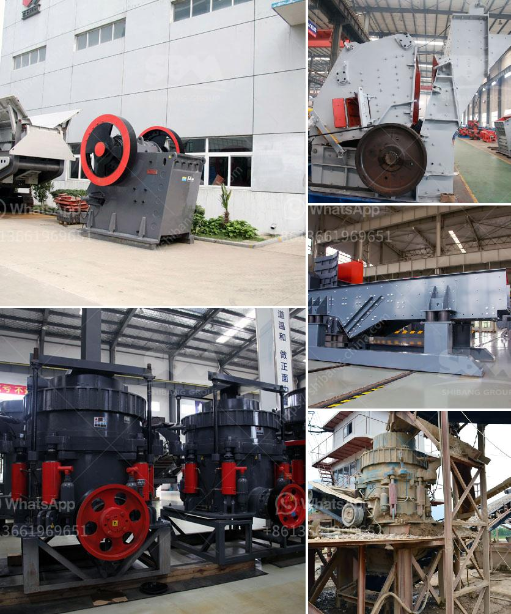

<h3>iron processing plant cost</h3>
Iron processing plants are essential for extracting and refining iron ore into usable products for various industries. These plants play a significant role in the production of materials that are used in construction, automotive manufacturing, and many other sectors. However, setting up an iron processing plant involves several costs that need to be considered.

One of the primary costs associated with building an iron processing plant is the initial investment. This includes the land acquisition, construction, and installation of machinery and equipment. The size and capacity of the plant will determine the total cost, with larger plants generally requiring more substantial investment. Additionally, factors like location and accessibility can also impact the overall cost.

Another major cost component is the cost of raw materials. Iron ore, which is the primary input for iron processing plants, needs to be sourced and transported to the facility. The availability and quality of iron ore can vary, influencing its price and subsequently impacting the processing plant's cost. The distance between the mine and the plant can also add transportation costs.

Operating costs, including labor, utilities, and maintenance, should also be considered. Skilled labor is required to operate the processing plant and ensure its smooth functioning. Utilities such as electricity and water are necessary during the production process and can contribute to the overall operational expenses. Regular maintenance and repairs are also crucial to keep the plant running efficiently and minimize downtime.

Environmental regulations and compliance costs are other essential factors that need to be considered. Iron processing plants must adhere to strict environmental standards to reduce pollution and mitigate the negative impact on surrounding ecosystems. Compliance with these regulations may involve investing in pollution control equipment, waste management systems, and monitoring mechanisms.

In conclusion, establishing an iron processing plant involves various cost factors. The initial investment, raw material costs, operating expenses, and environmental compliance are all significant contributors to the overall cost. Thorough planning and feasibility studies are necessary to estimate the financial requirements accurately and ensure the profitability and sustainability of the plant in the long run.
<h3>Contact us</h3><ul><li><strong>Whatsapp:&nbsp;<a href="https://wa.me/8613661969651">+8613661969651</a></strong></li><li><a href="https://swt.shibang-china.com/?git&amp;zhl&amp;iron processing plant cost"><strong>Online Service(chat now)</strong></a></li></ul><h3>Related</h3><ul><li><a href='granite feeding equipment manufacturer.md'>granite feeding equipment manufacturer</a></li><li><a href='calcium carbonate making machinery in germany.md'>calcium carbonate making machinery in germany</a></li><li><a href='processing of calcium carbonate.md'>processing of calcium carbonate</a></li><li><a href='quarry crusher equipment for sale in south africa.md'>quarry crusher equipment for sale in south africa</a></li><li><a href='impact crusher pdf.md'>impact crusher pdf</a></li></ul>