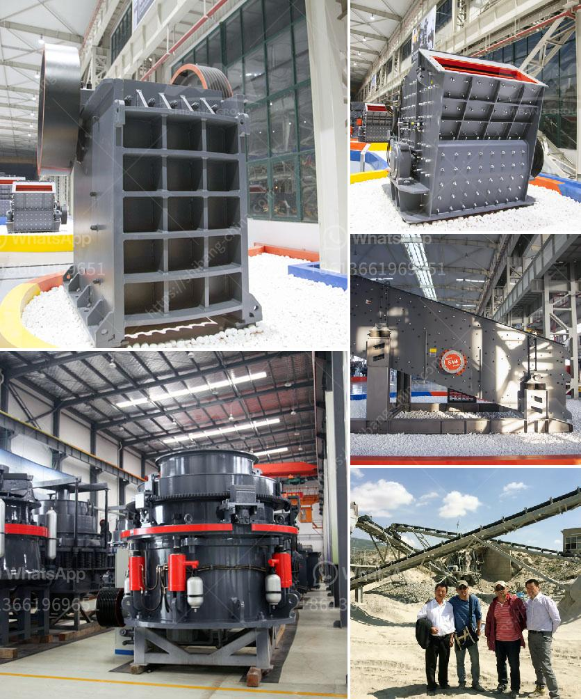

<h3>iron processing plant in mexico</h3>
Mexico, a country known for its rich natural resources, is now geared towards enhancing its industrial sector by investing in iron processing plants. These facilities play a crucial role in mining and extracting iron ores, which are essential raw materials for various industries, including construction, automotive, and manufacturing. With the establishment of iron processing plants, Mexico aims to stimulate economic growth, create jobs, and strengthen its position in the global market.

Historically, Mexico has been a significant producer of iron ores, mainly located in the northern states of Sonora, Coahuila, and Chihuahua. The country's iron reserves have attracted international mining companies, including ArcelorMittal and Ternium, who have invested in the construction of advanced processing plants. These plants utilize innovative technologies and equipment to transform raw iron ores into high-quality iron and steel products.

The iron processing plants employ a comprehensive production process that begins with the extraction of iron ores from mines. After the ores are collected, they undergo crushing, grinding, and screening procedures to obtain the desired particle size. This preparation enhances the efficiency of subsequent processes while ensuring that impurities are removed. Once the ores are prepared, they are processed in blast furnaces, where they are smelted at high temperatures to separate iron from other elements. This process results in the production of hot metal, which is further refined and shaped into various forms, such as billets, slabs, and coils.

The establishment of iron processing plants in Mexico offers numerous advantages for the country's industrial sector. Firstly, it ensures a stable supply of iron and steel products for domestic consumption. This reduces dependence on imports, thereby enhancing Mexico's self-sufficiency and reducing trade deficits. Additionally, these plants generate employment opportunities, both directly and indirectly, for thousands of workers. From mining operations to plant maintenance and management, the iron processing industry creates a chain of jobs that contribute to the overall socio-economic development of the country.

Moreover, the presence of iron processing plants in Mexico strengthens the country's competitiveness in the global market. With well-equipped facilities and efficient production processes, Mexico can produce iron and steel products at competitive prices while maintaining international quality standards. This enables the country to export its products to various countries, particularly the United States, which is one of the largest importers of Mexican steel. By expanding its export capabilities, Mexico can earn significant revenue and boost its foreign exchange reserves.

Furthermore, the iron processing industry in Mexico promotes technological advancements and innovations. As these plants aim to enhance efficiency and reduce environmental impacts, they invest in research and development activities to develop sustainable and environmentally friendly practices. This includes the utilization of clean energy sources and the implementation of measures to reduce greenhouse gas emissions and waste generation. By adopting eco-friendly practices, these plants contribute to environmental protection while remaining economically productive.

In conclusion, the establishment of iron processing plants in Mexico is a significant step towards enhancing the country's industrial sector. By harnessing its rich iron reserves, Mexico can stimulate economic growth, create jobs, and strengthen its position in the global market. These plants provide a stable supply of iron and steel products, reduce import dependency, create employment opportunities, and promote technological advancements. As Mexico continues to invest in the iron processing industry, it sets itself on a path to sustainable development and a thriving industrial sector.
<h3>Contact us</h3><ul><li><strong>Whatsapp:&nbsp;<a href="https://wa.me/8613661969651">+8613661969651</a></strong></li><li><a href="https://swt.shibang-china.com/?git&amp;zhl&amp;iron processing plant in mexico"><strong>Online Service(chat now)</strong></a></li></ul><h3>Related</h3><ul><li><a href='crusher plants for sale in south africa.md'>crusher plants for sale in south africa</a></li><li><a href='second hand crushers price in india.md'>second hand crushers price in india</a></li><li><a href='gold wash plant trommel for sale in dubai.md'>gold wash plant trommel for sale in dubai</a></li><li><a href='iron ore smelter equipment.md'>iron ore smelter equipment</a></li><li><a href='crushing and screening of manganese ore.md'>crushing and screening of manganese ore</a></li></ul>