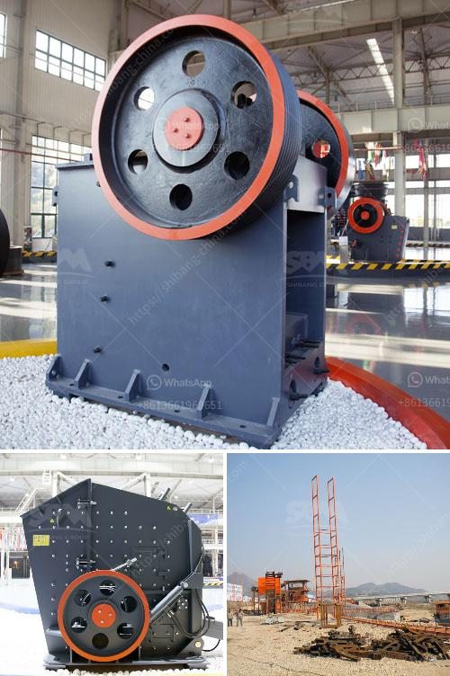

<h3>iron processing plant manufacturer machine line</h3>
Iron processing involves various processes such as mining, crushing, grinding, separation, and smelting, leading to the production of iron and steel. Iron processing plants require efficient machinery to process the raw materials and convert them into usable products. This is where iron processing plant manufacturer machine lines play a critical role. 

Iron processing plant manufacturer machine lines encompass a range of equipment that ensures smooth and efficient processing of iron ore. These machines are designed to handle various stages of iron processing and can handle large quantities of raw materials. The machine line consists of crushers, mills, separators, and smelters, all of which work together to transform iron ore into the desired product.

Crushers are used to break down large chunks of iron ore into smaller pieces, which then go through grinding mills. These mills use rotating cylinders or balls to pulverize the iron ore into a fine powder. The powdered iron ore is then separated using magnetic separators or flotation cells, which separate the iron from other minerals.

The separated iron is then smelted in furnaces to produce iron or steel. Smelting involves heating the iron ore to high temperatures and adding carbon to remove impurities and create the desired product. The smelting process requires specialized equipment such as blast furnaces or electric arc furnaces, which are often part of the iron processing plant manufacturer machine line.

Efficient iron processing plant manufacturer machine lines are essential for the production of iron and steel on a large scale. These machines not only ensure the smooth flow of operations but also optimize the usage of energy and resources. Modern machine lines incorporate advanced technologies and automation, resulting in increased productivity and reduced costs.

Choosing the right iron processing plant manufacturer machine line is crucial for any iron processing plant. Factors such as capacity, efficiency, and reliability should be considered while selecting the machine line. Collaborating with a reputable manufacturer who has expertise in iron processing can ensure the best quality machines that meet specific requirements.

In conclusion, iron processing plant manufacturer machine lines are vital for the efficient processing of iron ore and the production of iron and steel. With the right machines, a processing plant can achieve higher productivity and optimize operations, leading to cost savings and improved product quality. It is essential for iron processing plants to carefully choose reliable manufacturers that offer advanced and efficient machine lines to meet their specific demands.
<h3>Contact us</h3><ul><li><strong>Whatsapp:&nbsp;<a href="https://wa.me/8613661969651">+8613661969651</a></strong></li><li><a href="https://swt.shibang-china.com/?git&amp;zhl&amp;iron processing plant manufacturer machine line"><strong>Online Service(chat now)</strong></a></li></ul><h3>Related</h3><ul><li><a href='industrial fine powder grinding machinery.md'>industrial fine powder grinding machinery</a></li><li><a href='how to extract gold from river sand.md'>how to extract gold from river sand</a></li><li><a href='list mines and quarry owners of malaysia.md'>list mines and quarry owners of malaysia</a></li><li><a href='program to simulate conveyor belts.md'>program to simulate conveyor belts</a></li><li><a href='crusher plant design.md'>crusher plant design</a></li></ul>