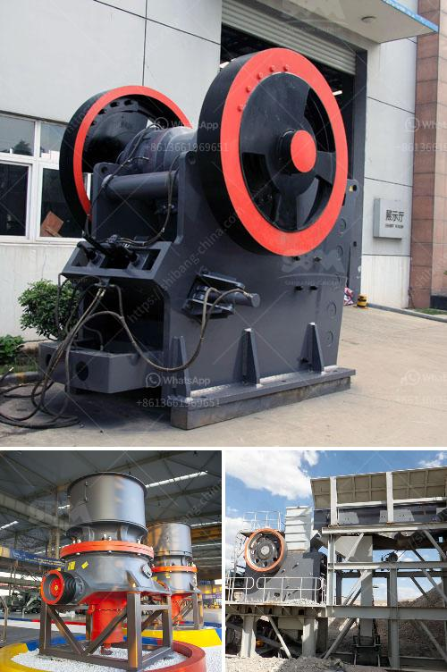

<h3>italia dry mortar production line supplier</h3>
Italia's dry mortar production line suppliers are renowned for their high-quality products and innovative solutions. These suppliers have gained a strong reputation in the construction industry for delivering efficient and reliable equipment that meets the demands of various projects.

Dry mortar production lines are used in the preparation of dry mix mortars, which are widely used in construction activities, especially for binding bricks, blocks, and stones. These production lines consist of different components, including cement silos, sand dryers, aggregate batching machines, and mixing machines. Italia's suppliers specialize in offering customized solutions that cater to the specific needs of their clients.

One of the key advantages of Italia's dry mortar production line suppliers is the use of advanced technology. They incorporate state-of-the-art machinery and equipment to ensure the production of consistent and high-quality products. These suppliers also focus on energy efficiency and environmentally friendly practices, contributing to sustainable construction practices.

Another notable feature of Italia's dry mortar production line suppliers is their commitment to customer satisfaction. They offer comprehensive after-sales services, including installation, training, and maintenance support. This ensures that clients can maximize the efficiency and longevity of their equipment.

Italia's dry mortar production line suppliers have established a global presence and continue to delight customers across the world. Their products are known for their durability, reliability, and cost-effectiveness. This has made them the go-to choice for contractors, builders, and construction professionals worldwide.

In conclusion, Italia's dry mortar production line suppliers have earned a reputation as industry leaders in delivering top-quality equipment and solutions. Their commitment to technological advancements, customer satisfaction, and sustainable practices makes them the ideal choice for anyone seeking reliable and efficient dry mortar production lines. Whether it's a small-scale project or a large construction venture, Italia's suppliers have the expertise and experience to meet every requirement.
<h3>Contact us</h3><ul><li><strong>Whatsapp:&nbsp;<a href="https://wa.me/8613661969651">+8613661969651</a></strong></li><li><a href="https://swt.shibang-china.com/?git&amp;zhl&amp;italia dry mortar production line supplier"><strong>Online Service(chat now)</strong></a></li></ul><h3>Related</h3><ul><li><a href='used marble machinery turkey.md'>used marble machinery turkey</a></li><li><a href='clay working clay powder making machine.md'>clay working clay powder making machine</a></li><li><a href='small diesel engine crusher from tanzania.md'>small diesel engine crusher from tanzania</a></li><li><a href='mobile crusher plant south africa.md'>mobile crusher plant south africa</a></li><li><a href='crusher unit price.md'>crusher unit price</a></li></ul>