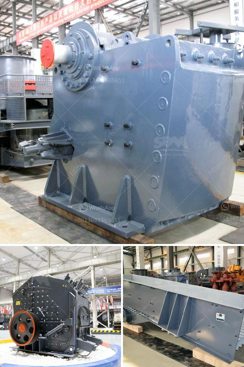

<h3>japan jaw crusher price</h3>
In recent years, with the rapid development of infrastructure projects, the demand for stone crushers in Japan is increasing. The sales volume of jaw crushers in the country has been growing steadily, and the price of these crushers is also increasing. 

The jaw crusher is a widely used crushing equipment in various industries, such as mining, building materials, chemical industry, metallurgy, and water conservancy. It is designed to crush various ores and large-sized materials into smaller sizes. The advantages of the jaw crusher lie in its high efficiency, low operating cost, easy maintenance, and long service life.

As the demand for jaw crushers in Japan is increasing, the prices of these crushers are also rising. There are several factors contributing to the price increase. Firstly, the cost of raw materials has been rising steadily. The raw materials used in jaw crushers, such as high-quality steel, iron, and manganese, are getting more expensive. This increase in raw material costs has directly affected the price of jaw crushers.

Secondly, the demand for jaw crushers has been consistently high. With the rapid development of infrastructure projects in Japan, the need for stone crushers has increased significantly. The ever-increasing demand for these crushers is putting pressure on the price. Manufacturers are adjusting their prices to meet the high demand and make a profit.

Additionally, the technological advancements in jaw crushers have also led to a price increase. With the development of new materials and manufacturing techniques, jaw crushers are becoming more efficient and durable. These advancements require additional investment, which is reflected in the price of the crushers.

Despite the rising prices, investing in a jaw crusher in Japan is still considered a wise decision. The high efficiency of these crushers can greatly improve the productivity of construction projects. The durability and low maintenance features ensure a long service life and reduced operating costs in the long run. Furthermore, jaw crushers can be easily transported and installed, making them suitable for mobile stone crushing operations.

To make the most out of the increasing prices, potential buyers should compare multiple suppliers and carefully evaluate the features and prices of different jaw crushers. It is advisable to choose a reputable manufacturer with a good after-sales service and warranty. Suppliers who offer competitive prices and flexible payment terms should also be considered.

In conclusion, the demand for jaw crushers in Japan is increasing, and so are their prices. The rising cost of raw materials, high demand, and technological advancements are the main factors contributing to the increase in prices. However, investing in a jaw crusher is still a smart decision, as it offers high efficiency, low operating costs, and long service life. Potential buyers should compare prices and features from different suppliers to make an informed decision.
<h3>Contact us</h3><ul><li><strong>Whatsapp:&nbsp;<a href="https://wa.me/8613661969651">+8613661969651</a></strong></li><li><a href="https://swt.shibang-china.com/?git&amp;zhl&amp;japan jaw crusher price"><strong>Online Service(chat now)</strong></a></li></ul><h3>Related</h3><ul><li><a href='malaysia stone crushing machine crusher for sale.md'>malaysia stone crushing machine crusher for sale</a></li><li><a href='silica sand washing process.md'>silica sand washing process</a></li><li><a href='europe conveyor belts manufacturer.md'>europe conveyor belts manufacturer</a></li><li><a href='sand washing machine saudi.md'>sand washing machine saudi</a></li><li><a href='write an article about cube crushing machine for concrete with 100300 words.md'>write an article about cube crushing machine for concrete with 100-300 words</a></li></ul>