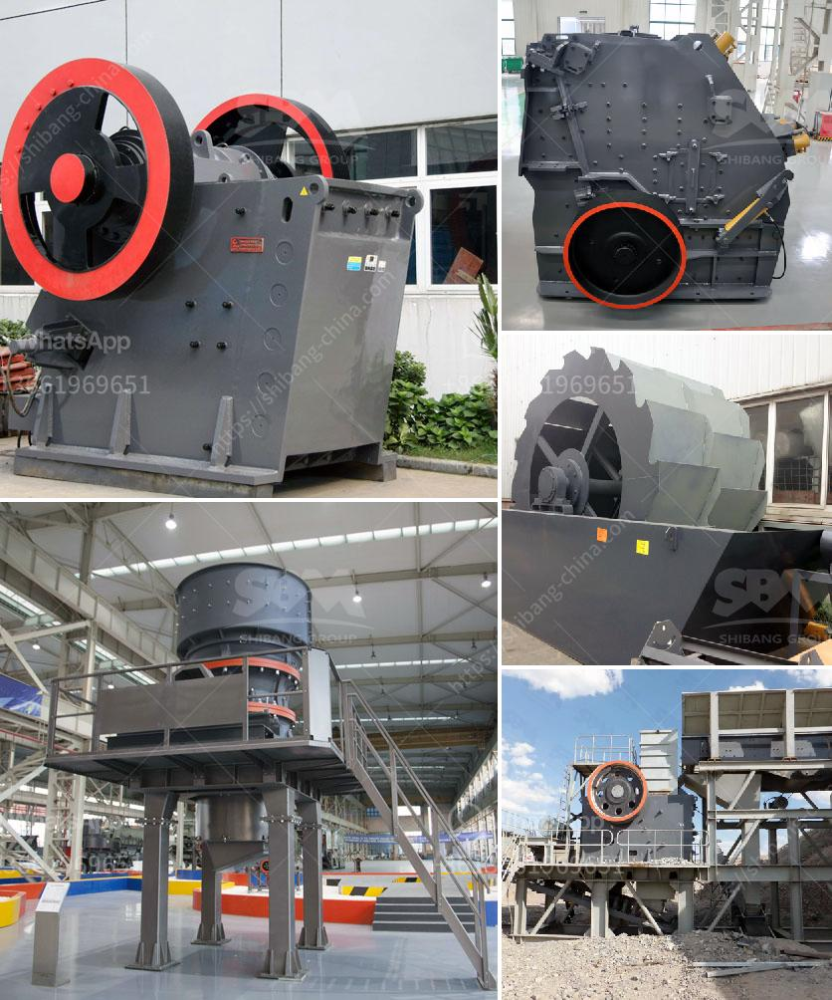

<h3>jaw and cone crusher</h3>
Jaw and cone crushers are popularly used equipment types, but there are key differences between these two machines. Jaw crushers are primarily used for crushing big rocks into small rocks or gravel, while cone crushers are used to break down raw materials such as rocks, concrete, and ore.

Cone crushers have an eccentrically rotating shaft that crushes rocks by compressing them between an oscillating cone and a concave bowl. Cone crushers are popular due to their ability to crush various materials and provide an excellent shape of the end product. However, their main drawback is their high wear rates, especially when processing abrasive materials.

On the other hand, jaw crushers consist of a fixed jaw and a movable jaw. This compression crusher operates by applying pressure on the rock between two jaws; one stationary and the other moveable. Jaw crushers are ideal for various mining operations and construction industries, reducing large-sized rocks into smaller-sized rocks or rock dust. They are also frequently used in recycling applications due to their low maintenance and operational costs.

One key advantage of jaw crushers is their durability and low maintenance requirements. Highly resistant to abrasion, these machines can withstand heavy-duty applications and operate for long periods with minimal downtime. Additionally, with the advancement in technology, jaw crushers have become more versatile and can handle a wider range of materials. Some modern jaw crushers are equipped with hydraulic systems that allow operators to quickly adjust the size of the discharge opening, ensuring better control over the final product.

Both jaw and cone crushers have their pros and cons, and it ultimately depends on the specific application requirements. Jaw crushers are well-suited for processing abrasive material, but cone crushers are considered more efficient for secondary or tertiary crushing processes. When it comes to choosing between the two, consider the desired product size, capacity, costs, and environmental impact.

In conclusion, jaw and cone crushers are essential equipment in mining and construction industries. However, jaw crushers are generally preferred due to their durability, low maintenance requirements, and ability to handle abrasive materials. Cone crushers, on the other hand, offer the advantage of producing a well-shaped end product but may require higher maintenance. Proper machine selection should be based on the specific needs of the application to ensure optimal performance and cost-effectiveness.
<h3>Contact us</h3><ul><li><strong>Whatsapp:&nbsp;<a href="https://wa.me/8613661969651">+8613661969651</a></strong></li><li><a href="https://swt.shibang-china.com/?git&amp;zhl&amp;jaw and cone crusher"><strong>Online Service(chat now)</strong></a></li></ul><h3>Related</h3><ul><li><a href='screw feeder capacity 5 ton hour.md'>screw feeder capacity 5 ton hour</a></li><li><a href='sewa mobil crusher di kaltim.md'>sewa mobil crusher di kaltim</a></li><li><a href='crushing plant in pakistan.md'>crushing plant in pakistan</a></li><li><a href='sand and gravel suppliers located in cebu.md'>sand and gravel suppliers located in cebu</a></li><li><a href='crusher for pozzolana.md'>crusher for pozzolana</a></li></ul>