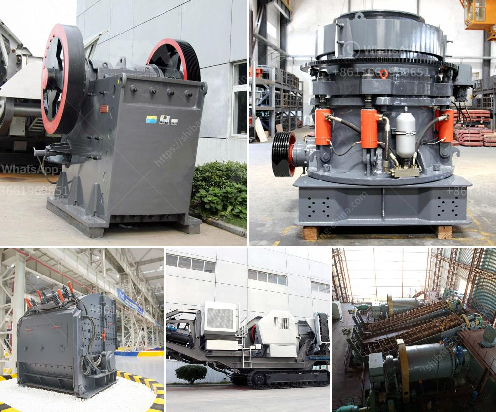

<h3>jaw crusher capacity</h3>
Crushing is a vital process in many industrial sectors, ranging from mining to construction to cement making. But, this process can become a bottleneck if a crusher has inadequate capacity or if it fails to operate efficiently. With today's high-performance machines, certain factors have to be taken into consideration while selecting the right equipment like the jaw crusher capacity.

The jaw crusher is widely used in the primary crushing of materials which are classified as medium-hard. It is capable of crushing all types of materials with a compressive strength of up to 320 MPa. The jaw crusher's main function is to reduce the size of the raw materials or large samples of materials into smaller sizes. This reduces the burden on the downstream crushing equipment, making it more efficient and economical.

Capacity plays a crucial role in the performance of any crusher. Jaw crushers are specifically designed to handle large feed sizes, as compared to other crushers, designed for mainly medium to small-sized operations. Therefore, the usage of a jaw crusher has a direct impact on the quality and quantity of the processed materials.

One of the most significant factors is the jaw crusher's capacity. Jaw crushers are rated for a specific maximum feed size, which is considered crucial in crushing applications. In order to achieve the best output and quality, the access to feed material should be limited to the maximum size that the crusher can handle. This is why it is essential to check the manufacturer's specifications and consult with an expert to determine the ideal size for your specific application.

Improperly sized materials can cause jamming, uneven wear on the jaw plates, and reduced overall efficiency. If the feed is too small, it can lead to reduced production and unwanted additional costs. On the other hand, if the feed is too large, it can cause increased wear on the crusher and result in frequent breakdowns and maintenance. Therefore, relevant attention needs to be paid to the size of materials while choosing a jaw crusher.

Moreover, it is not just about meeting the minimum required capacity. To ensure maximum productivity, it is essential to have enough excess capacity. This allows for faster processing of materials, reduces downtime, and provides flexibility in accommodating unexpected fluctuations in demand.

The capacity of a jaw crusher depends on various factors such as the type of input material, feed size, and the desired product size. So, even a small crusher can produce a considerable amount of final products if properly managed. Jaw crushers such as the PE series are famously used in the primary, secondary, and tertiary stage of crushing. These crushers are suitable for operations that involve lowering the size of larger rocks to a size that can be processed by secondary or tertiary crushers.

Considering the fact that jaw crushers have a wide range of applications as compared to other crushers, they offer high levels of efficiency. This means that customers can crush a large amount of material using a relatively small footprint. Jaw crushers also offer many other benefits such as low maintenance needs, durability, and ease of operation.

In conclusion, jaw crusher capacity plays a key role in ensuring the effectiveness of the entire crushing circuit. It is important to choose the right crusher for the feed material and to ensure that the feed is evenly distributed across the crushing chamber. To optimize production and reduce maintenance costs, it is essential to operate the crusher within its capacity. By considering all these factors, one can achieve the maximum potential and efficiency of a jaw crusher.
<h3>Contact us</h3><ul><li><strong>Whatsapp:&nbsp;<a href="https://wa.me/8613661969651">+8613661969651</a></strong></li><li><a href="https://swt.shibang-china.com/?git&amp;zhl&amp;jaw crusher capacity"><strong>Online Service(chat now)</strong></a></li></ul><h3>Related</h3><ul><li><a href='mini concrete crusher hire high wycombe.md'>mini concrete crusher hire high wycombe</a></li><li><a href='iron mining crusher.md'>iron mining crusher</a></li><li><a href='talcum powder grinding machine in kerala.md'>talcum powder grinding machine in kerala</a></li><li><a href='price of a vibrating screen.md'>price of a vibrating screen</a></li><li><a href='sand manufacturing machine price in tamilnadu.md'>sand manufacturing machine price in tamilnadu</a></li></ul>