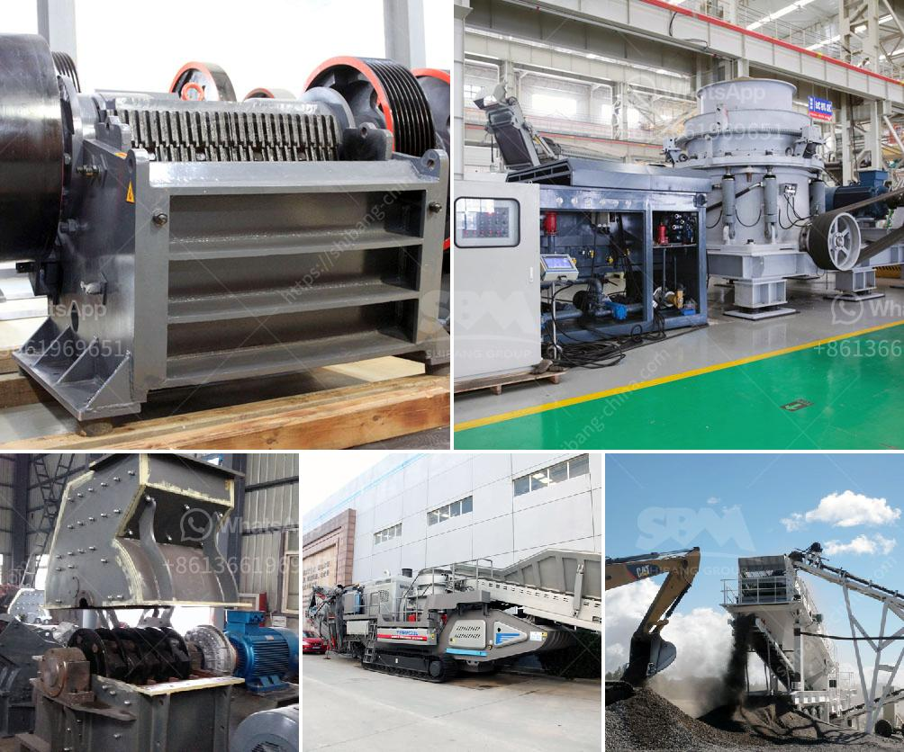

<h3>jaw crusher company</h3>
The jaw crusher is an essential piece of equipment for efficient crushing of hard and abrasive materials. With the advancement of technology, the jaw crusher has come a long way in terms of design, capacity, and efficiency. Today, XYZ Jaw Crusher Company is a leading manufacturer of jaw crushers, which are built to last and take heavy-duty beating during the mining or construction operations.

XYZ Jaw Crusher Company has exclusively developed jaw crushers that offer unique features and capabilities. Their commitment to innovation is visible in the inclusion of the latest technological advancements in their products. These jaw crushers incorporate cutting-edge hydraulic systems, reliable toggle plates, robust body structure, and energy-efficient motor options. The improved construction and smart design ensure optimal performance, enhanced crushing capacity, reduced maintenance downtime, and increased durability.

XYZ Jaw Crusher Company offers an extensive range of jaw crusher models, to meet the diverse needs of customers. Their jaw crushers are available in various sizes, which are designed to exceed the primary crushing needs of customers in the mining, quarrying, and recycling industries. Whether it's hard rock, limestone, gravel, or concrete, XYZ Jaw Crusher Company has a jaw crusher solution for every application. Additionally, these models can be customized with different jaw plates, eccentric shafts, and motor configurations, to achieve the desired output and efficiency levels.

XYZ Jaw Crusher Company understands the importance of customer satisfaction and support. They prioritize building strong relationships with their customers by offering comprehensive support throughout the buying process and beyond. Their experienced and knowledgeable team guides customers in selecting the right jaw crusher model, tailored to their specific requirements. Furthermore, they provide excellent after-sales service, including maintenance, spare parts availability, troubleshooting assistance, and technical support. This dedication to customer satisfaction ensures smooth operations, reduced downtime, and enhanced productivity for their customers.

Beyond delivering high-performance jaw crushers, XYZ Jaw Crusher Company is committed to sustainable operations. They strive to minimize the environmental impact of their products and manufacturing processes. This includes implementing energy-efficient technologies in their products and promoting responsible waste management throughout their operations. By adopting sustainable practices, XYZ Jaw Crusher Company aims to contribute towards a greener future for the industry.

XYZ Jaw Crusher Company is a reliable and technologically advanced manufacturer of jaw crushers. With a strong focus on customer satisfaction and support, they provide top-notch products that not only meet but exceed the expectations of their customers in terms of performance, durability, and innovation.
<h3>Contact us</h3><ul><li><strong>Whatsapp:&nbsp;<a href="https://wa.me/8613661969651">+8613661969651</a></strong></li><li><a href="https://swt.shibang-china.com/?git&amp;zhl&amp;jaw crusher company"><strong>Online Service(chat now)</strong></a></li></ul><h3>Related</h3><ul><li><a href='gold sand processing technology.md'>gold sand processing technology</a></li><li><a href='sand crusher machine hyderabad for sale.md'>sand crusher machine hyderabad for sale</a></li><li><a href='jaw crusher supplier of new zealand.md'>jaw crusher supplier of new zealand</a></li><li><a href='iron ore smelter equipment.md'>iron ore smelter equipment</a></li><li><a href='turkey cone crusher.md'>turkey cone crusher</a></li></ul>