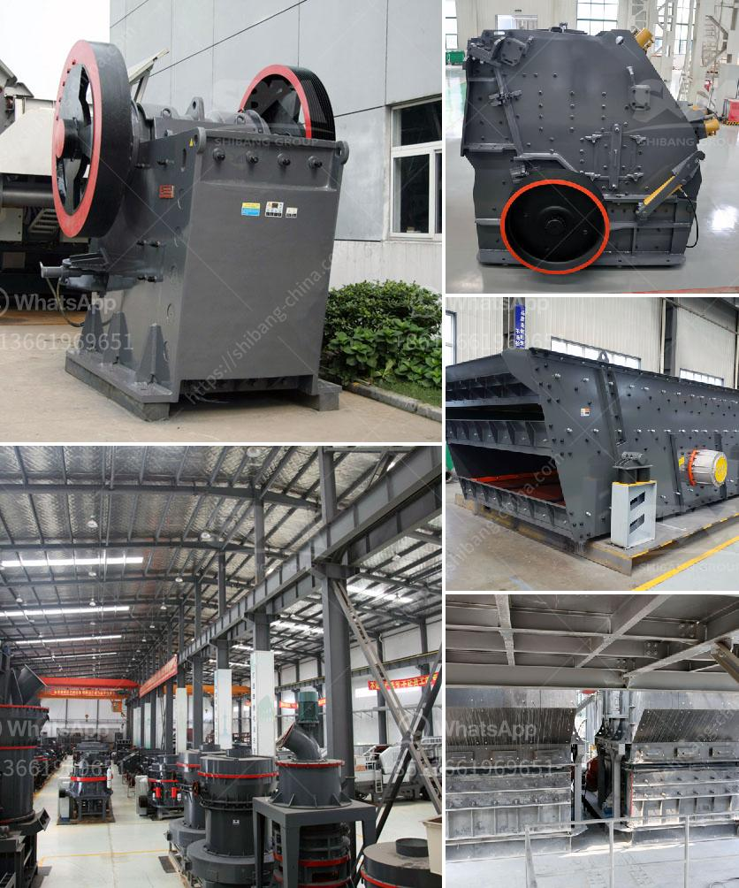

<h3>jaw crusher design handbook</h3>
The Jaw Crusher Design Handbook is a comprehensive guide to designing and operating jaw crushers. The handbook describes every aspect of the design process in detail and provides valuable and timely information on the construction, operation, maintenance, and troubleshooting of jaw crushers. This includes the design of the mechanical and electrical systems, as well as the necessary safety precautions.

The handbook begins with an introduction to jaw crushers and their applications, providing an overview of the various types of jaw crushers available in the industry. It then proceeds to discuss the design considerations for jaw crushers, including dimensions, capacity, and power requirements. The handbook also covers the selection of materials for jaw crusher components, such as liners, shafts, bearings, and flywheels, ensuring optimal performance and durability.

Furthermore, the Jaw Crusher Design Handbook emphasizes the importance of proper maintenance to prolong the lifespan of the equipment. It provides guidelines on regular inspections, lubrication, and troubleshooting common issues that may arise during operation. By following these guidelines, operators can minimize downtime and maximize productivity.

The handbook also addresses safety concerns associated with jaw crusher operation. It highlights the necessary safety precautions that should be observed, such as wearing personal protective equipment, utilizing proper guarding, and following lockout/tagout procedures. This ensures the safety of both the operators and those working in the vicinity of the jaw crusher.

In conclusion, the Jaw Crusher Design Handbook is a comprehensive guide to designing, operating, and maintaining jaw crushers. It provides valuable and timely information on every aspect of the design process, ensuring the smooth operation and long-term reliability of this essential crushing equipment. Whether you are a designer, operator, or maintenance personnel, this handbook is an invaluable resource that will greatly enhance your understanding and proficiency in jaw crusher operation.
<h3>Contact us</h3><ul><li><strong>Whatsapp:&nbsp;<a href="https://wa.me/8613661969651">+8613661969651</a></strong></li><li><a href="https://swt.shibang-china.com/?git&amp;zhl&amp;jaw crusher design handbook"><strong>Online Service(chat now)</strong></a></li></ul><h3>Related</h3><ul><li><a href='cost of a stone crusher machine.md'>cost of a stone crusher machine</a></li><li><a href='looking for hammer mill.md'>looking for hammer mill</a></li><li><a href='ball mill making from turkey.md'>ball mill making from turkey</a></li><li><a href='stone crusher manufacturer dhaka.md'>stone crusher manufacturer dhaka</a></li><li><a href='ballast crusher cost.md'>ballast crusher cost</a></li></ul>