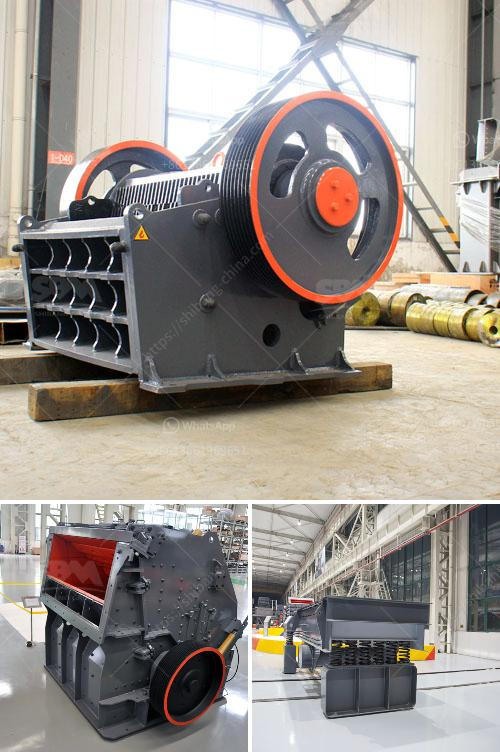

<h3>jaw crusher di indonesia</h3>
Crusher rahang - dikenal juga sebagai jaw crusher - merupakan alat penghancur utama yang digunakan dalam industri pertambangan, metalurgi, konstruksi, keramik, dan sektor lainnya. Mesin ini secara efektif menghancurkan material mentah menjadi ukuran yang lebih kecil, sehingga memudahkan proses produksi selanjutnya. Di Indonesia, permintaan akan jaw crusher terus meningkat dengan pesat, seiring dengan perkembangan sektor industri di negara ini.

Salah satu alasan mengapa jaw crusher sangat populer di Indonesia adalah karena negara ini memiliki sumber daya alam yang kaya, seperti tambang batu bara, nikel, emas, dan tembaga. Jaw crusher memainkan peran penting dalam mengekstrak, menghancurkan, dan memproses material-material ini menjadi ukuran yang lebih kecil sesuai dengan kebutuhan industri.

Selain itu, pertumbuhan perkotaan yang pesat di Indonesia juga mempengaruhi permintaan jaw crusher. Dalam industri konstruksi, jaw crusher digunakan untuk menghancurkan batu, beton, dan bahan bangunan lainnya menjadi agregat yang diperlukan untuk proyek-proyek pembangunan. Dalam hal ini, jaw crusher membantu meningkatkan efisiensi dan produktivitas dalam proses konstruksi.

Beberapa produsen terkemuka di dunia, seperti Sandvik, Metso, dan Terex, telah menjalin kemitraan dengan distributor lokal untuk memasok jaw crusher di Indonesia. Mereka menyediakan berbagai jenis jaw crusher dengan kapasitas yang berbeda, sesuai dengan kebutuhan pelanggan. Selain itu, perusahaan-perusahaan ini juga menawarkan layanan purna jual yang handal, yang meliputi suku cadang, dukungan teknis, dan pelatihan untuk penggunaan yang aman.

Jaw crusher di Indonesia semakin terbukti menjadi peralatan yang penting dalam industri penghancuran. Dalam beberapa tahun terakhir, banyak perusahaan dan pabrik telah menginvestasikan jaw crusher untuk meningkatkan produktivitas dan efisiensi produksi mereka. Dengan perkembangan lebih lanjut, diharapkan permintaan akan jaw crusher di Indonesia akan terus meningkat, sementara industri penghancuran semakin memperkuat posisinya sebagai sektor yang kritis dalam mendukung pertumbuhan ekonomi negara ini.
<h3>Contact us</h3><ul><li><strong>Whatsapp:&nbsp;<a href="https://wa.me/8613661969651">+8613661969651</a></strong></li><li><a href="https://swt.shibang-china.com/?git&amp;zhl&amp;jaw crusher di indonesia"><strong>Online Service(chat now)</strong></a></li></ul><h3>Related</h3><ul><li><a href='small coal mining machine.md'>small coal mining machine</a></li><li><a href='ball mill instrument equipment.md'>ball mill instrument equipment</a></li><li><a href='cost of copper ore processing plant.md'>cost of copper ore processing plant</a></li><li><a href='coal grinding machine.md'>coal grinding machine</a></li><li><a href='grinding mill machine price in chennai.md'>grinding mill machine price in chennai</a></li></ul>