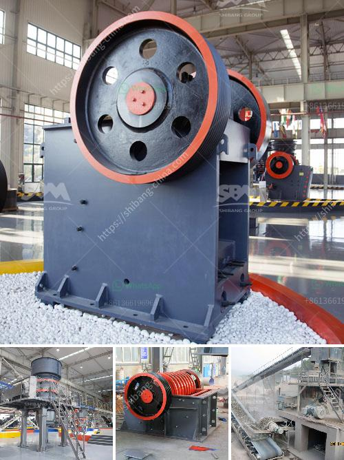

<h3>jaw crusher each equipment</h3>
The jaw crusher is a versatile and indispensable piece of equipment in any mining, construction, or demolition industry. With its rugged and sturdy design, the jaw crusher provides reliable operation even in the toughest conditions. To ensure maximum productivity and efficiency, the jaw crusher comes with a range of features and benefits. In this article, we will explore each of these features in detail.

One of the key features of the jaw crusher is its ability to handle various materials. Whether it is granite, limestone, or concrete, the jaw crusher has the capability to crush all types of materials. This makes it ideal for a wide range of applications, including mining, construction, and demolition projects. Furthermore, the jaw crusher allows for easy adjustment of the discharge setting, ensuring optimal performance for different materials.

Another important feature of the jaw crusher is its efficiency in crushing. The jaw crusher uses a compressive force to break down materials, reducing them into finer particles. This not only improves the efficiency of the crushing process but also reduces the amount of energy required to crush the materials. As a result, the jaw crusher consumes less power and produces less heat, contributing to a more sustainable and cost-effective operation.

Durability is also a key aspect of the jaw crusher. Constructed with high-quality materials, the jaw crusher is built to withstand heavy-duty use and harsh environments. Whether it is in a quarry or on a construction site, the jaw crusher can withstand constant impacts and resist wear and tear. This ensures a long service life and reduces the need for frequent maintenance or replacements of parts.

Additionally, the jaw crusher is user-friendly, designed to be easy to operate and maintain. With its simple and intuitive controls, operators can quickly learn how to use the jaw crusher efficiently. The jaw crusher also features a hydraulic system for quick and easy adjustment of the crushing gap. This allows operators to quickly change the size of the crushed material, ensuring precise and consistent output.

Finally, the jaw crusher is designed for safety. It includes various safety features to protect operators and prevent accidents. For example, the jaw crusher is equipped with a safety toggle plate that prevents uncrushable materials from entering the crushing chamber. This reduces the risk of damage to the crusher and ensures smooth operation. Moreover, the jaw crusher is equipped with a hydraulic wedge adjustment system that allows for safe and easy access to the crushing chamber during maintenance or clearing of blockages.

In conclusion, the jaw crusher is a vital piece of equipment that plays a crucial role in various industries. Its ability to handle different materials, efficiency in crushing, durability, user-friendliness, and safety features make it an excellent choice for any job site. Whether used in mining, construction, or demolition, the jaw crusher is an essential machine that delivers reliable performance and high productivity.
<h3>Contact us</h3><ul><li><strong>Whatsapp:&nbsp;<a href="https://wa.me/8613661969651">+8613661969651</a></strong></li><li><a href="https://swt.shibang-china.com/?git&amp;zhl&amp;jaw crusher each equipment"><strong>Online Service(chat now)</strong></a></li></ul><h3>Related</h3><ul><li><a href='calcite powder machine.md'>calcite powder machine</a></li><li><a href='design and fabrication of ball mill pdf.md'>design and fabrication of ball mill pdf</a></li><li><a href='cone crusher instructions.md'>cone crusher instructions</a></li><li><a href='caterpillar stone crusher.md'>caterpillar stone crusher</a></li><li><a href='stone crusher punjab ropar.md'>stone crusher punjab ropar</a></li></ul>