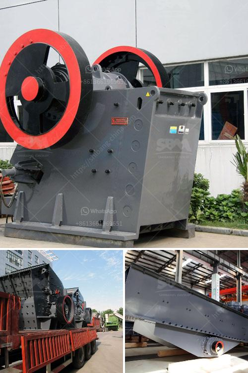

<h3>jaw crusher for barite crushing</h3>
A jaw crusher is a necessary device for crushing stones and rocks. It is often used in various industries, including mining, construction, metallurgy, highways, and railways. This essential piece of equipment is designed to crush and break down large-sized rocks into smaller pieces. The jaw crusher for barite crushing is a professional crushing equipment that mainly processes barite.

The jaw crusher is mainly used for coarse crushing and medium crushing in the mining, building materials, infrastructure, and other industries. As a coarse crushing equipment, the jaw crusher has a wider range of applications. It is often used in mining, construction, metallurgy, highways, railways, water conservancy, and chemical industries. It can crush various ores and bulk materials with a compressive strength not exceeding 320MPa.

When using the jaw crusher for barite crushing, the large-sized barite is firstly crushed by the jaw crusher through the feeding port, and then the crushed material is uniformly transported to the barite crushing chamber for grinding. The close cooperation between the jaw crusher and the barite mill ensures the efficient processing of barite. After the barite passes through the crushing chamber, it is sifted through a vibrating screen, and the qualified powder material is sent to a barite mill for grinding, while the unqualified barite material is returned to the jaw crusher for re-crushing, forming a closed-loop recycling process.

There are several advantages of using a jaw crusher for barite crushing. Firstly, the equipment has a large crushing ratio and high processing capacity, which can meet the needs of large-scale barite production. Secondly, the jaw crusher has low energy consumption and low production cost, which effectively reduces the production cost of barite. Thirdly, the equipment is easy to operate and maintain, reducing the labor and time cost of the operator.

In addition, the jaw crusher for barite crushing has a simple structure, reliable operation, and low failure rate. It is often used as a primary crushing equipment for barite, with stable performance, high efficiency, and long service life. Moreover, the equipment has a small footprint, which saves space and reduces construction costs.

However, when using the jaw crusher for barite crushing, there are also some precautions that need to be taken. Firstly, it is important to choose a suitable jaw crusher model according to the size and hardness of the barite. Secondly, the operator should pay attention to the operating instructions and maintenance of the equipment to avoid accidents caused by improper operation.

In conclusion, the jaw crusher for barite crushing is an essential piece of equipment for barite processing. It has the advantages of large crushing ratio, low energy consumption, low production cost, simple structure, reliable operation, and easy maintenance. With its help, the efficient processing of barite can be achieved, contributing to the development of various industries.
<h3>Contact us</h3><ul><li><strong>Whatsapp:&nbsp;<a href="https://wa.me/8613661969651">+8613661969651</a></strong></li><li><a href="https://swt.shibang-china.com/?git&amp;zhl&amp;jaw crusher for barite crushing"><strong>Online Service(chat now)</strong></a></li></ul><h3>Related</h3><ul><li><a href='stone crusher malaysia.md'>stone crusher malaysia</a></li><li><a href='price of a mobile crasher sri lanka.md'>price of a mobile crasher sri lanka</a></li><li><a href='aggregate crusher 200 meter capacity.md'>aggregate crusher 200 meter capacity</a></li><li><a href='how much does gold mining licences in nigeria.md'>how much does gold mining licences in nigeria</a></li><li><a href='manufacturing of conveyor belts in the vaal region.md'>manufacturing of conveyor belts in the vaal region</a></li></ul>