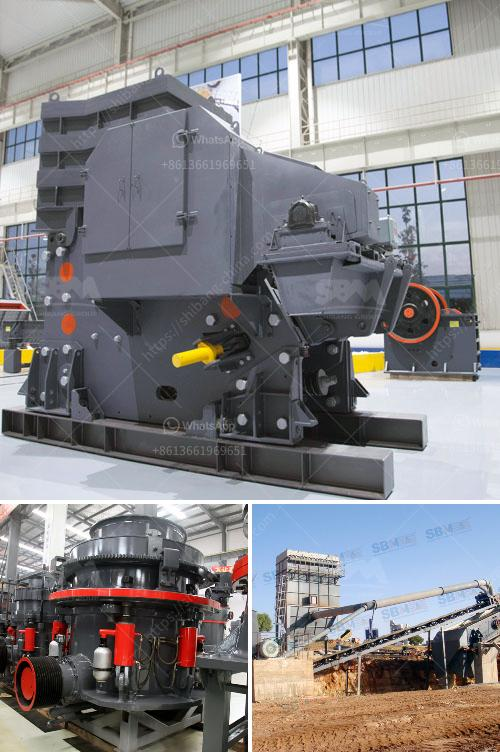

<h3>jaw crusher for sale south africa</h3>
The jaw crusher is one of the most commonly used on sale in South Africa today. It is a versatile machine that can be used in various applications, such as mining, quarrying, and recycling. This machine is efficient in crushing hard materials that are difficult to break down. In South Africa, the jaw crusher is widely used in mining, construction materials, chemical industry, metallurgy and so on.

The jaw crusher is suitable for primary and secondary crushing all kinds of minerals and rocks with compressive strength less than 320 MPa. In South Africa, jaw crusher is mainly used for primary crushing of aggregate and sand production, gold mining, iron ore crushing, and copper ore beneficiation plant.

The right jaw plate design can increase life expectancy. The jaw plate design can optimize wear parts’ life expectancy and increase production if utilized correctly. In South Africa, the jaw crusher machine is popular due to its high performance and competitive price.

With the growing demand of South Africa's construction industry, the need for robust and reliable equipment is increasing. The jaw crusher machine has been tremendously popular in South Africa due to its excellent performance in the construction industry.

There are many reasons that make South Africa's jaw crushers popular, including but not limited to the following:

1. High productivity: The jaw crusher machine has a high production capacity and can break large size aggregates into smaller ones.

2. Versatile applications: Jaw crushers are suitable for various applications, including quarrying, recycling, construction waste disposal, and mining.

3. Cost-saving: Jaw crushers are cost-effective as they consume less energy and require low maintenance.

When looking for jaw crushers for sale in South Africa, there are several factors to consider, such as:

1. Type of machine: There are different types of jaw crushers available, including those with a double toggle and overhead eccentric. The choice depends on the required output size and the material being crushed.

2. Size of the machine: The size of the jaw crusher machine should be chosen based on the maximum particle size that can be processed and the desired output size.

3. Price: While price is an important factor, it should not be the sole determining factor. Quality and reliability should also be considered when purchasing a jaw crusher.

4. After-sales service: Ensure that the manufacturer offers after-sales service and technical support to resolve potential issues.

In conclusion, the jaw crusher is a versatile and reliable machine that plays a crucial role in South Africa's construction industry. It is well-suited for various applications and offers high productivity at a competitive price. When purchasing a jaw crusher for sale in South Africa, make sure to consider the type of machine, size, price, and after-sales service.
<h3>Contact us</h3><ul><li><strong>Whatsapp:&nbsp;<a href="https://wa.me/8613661969651">+8613661969651</a></strong></li><li><a href="https://swt.shibang-china.com/?git&amp;zhl&amp;jaw crusher for sale south africa"><strong>Online Service(chat now)</strong></a></li></ul><h3>Related</h3><ul><li><a href='equipment for gold mine tailings in ghana.md'>equipment for gold mine tailings in ghana</a></li><li><a href='hydraulic cone crushers.md'>hydraulic cone crushers</a></li><li><a href='second hand jaw crusher for sale in harare.md'>second hand jaw crusher for sale in harare</a></li><li><a href='vibrating vibrating grizzly feeder capacity.md'>vibrating vibrating grizzly feeder capacity</a></li><li><a href='vertical grinder mill price.md'>vertical grinder mill price</a></li></ul>