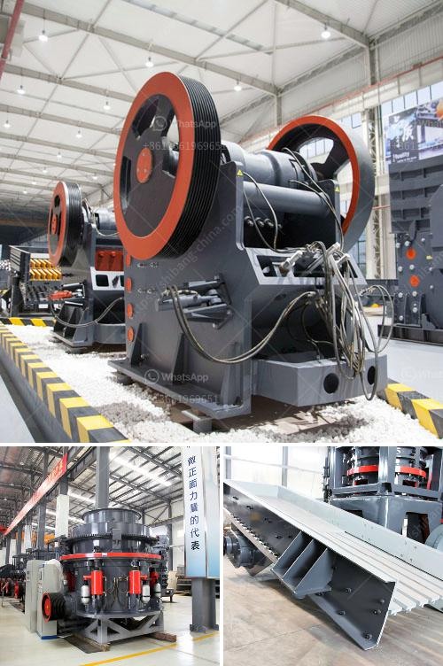

<h3>jaw crusher from china</h3>
Jaw crusher is a commonly used crusher equipment. We all know that its working environment and material characteristics have a certain impact on the service life of the equipment. Therefore, the maintenance work during the operation of the jaw crusher must be carried out in strict accordance with the operation process, so that its life can be prolonged. In this article, we will introduce the jaw crusher from China in detail.

The jaw crusher from China has a frame structure of the whole equipment, which is made of cast steel. The eccentric shaft and moving jaw are made of high-quality cast steel, and the overall forging processing is carried out. It ensures the stability of the whole equipment. 

The jaw crusher has a deep crushing chamber and a larger crushing ratio. This feature allows the equipment to have a higher crushing efficiency, which is beneficial to the overall processing capacity of the entire production line. It also greatly improves the flexibility of the equipment.

The lubrication system of the jaw crusher is safe and reliable, and it is easy to replace parts. The maintenance workload is small, and the operation is simple. It is convenient to add grease without dismantling the side of the rack.

The jaw crusher has simple structure, easy manufacture and reliable operation. Advantage of China jaw crusher: Structure design of the jaw crusher principle and mechanism, easy maintenance; processing capacity, simple structure and low stone processing production cost; stable structure, high efficiency and energy saving materials, you can change the crushing cavity, to obtain even grain size, good wear resistance.

The jaw crusher in China is sold very well. In fact, we have many kinds of types crushing equipment, which mainly include jaw crusher, cone crusher, impact crusher, VSI5X crusher, VSI crusher and so on. Meanwhile we have mobile stone crusher. Among all these equipment, VSI5X is the latest and high efficiency stone crushing machinery, which integrates many patents and three crushing methods. The adoption of deep chamber can make the crushing efficiency and ratio even higher.

In addition, the jaw crusher from China has a certain problem in welding process. However, it is developed under strict control and has been improved continuously. So, it has better performance, higher efficiency and lower production cost in the medium and fine crushing operations. In addition, it has excellent performance in processing medium-hard materials such as limestone, coal, salt, various kinds of ore and rock.

At present, the product has been used in various fields of the national economy, and various industrial departments, such as: mining, refining, building materials, metallurgy, road repair, etc. Due to its simple structure, solid and reliable work and convenient maintenance, it has been widely used in coarse crushing and medium crushing operations in various mining fields.

In conclusion, the jaw crusher from China has been widely used in the industries of mining, metallurgy, chemical engineering, building materials, water conservancy and hydropower and various other related industries. With its wide application range, powerful crushing ability and simplified operation, it has been favored by the majority of users in the industry.
<h3>Contact us</h3><ul><li><strong>Whatsapp:&nbsp;<a href="https://wa.me/8613661969651">+8613661969651</a></strong></li><li><a href="https://swt.shibang-china.com/?git&amp;zhl&amp;jaw crusher from china"><strong>Online Service(chat now)</strong></a></li></ul><h3>Related</h3><ul><li><a href='lime powder machine.md'>lime powder machine</a></li><li><a href='river stone crushing plant crusher.md'>river stone crushing plant crusher</a></li><li><a href='how to use hammer mill.md'>how to use hammer mill</a></li><li><a href='project cost of mini clinker grinding plant.md'>project cost of mini clinker grinding plant</a></li><li><a href='ball mill instrument equipment.md'>ball mill instrument equipment</a></li></ul>