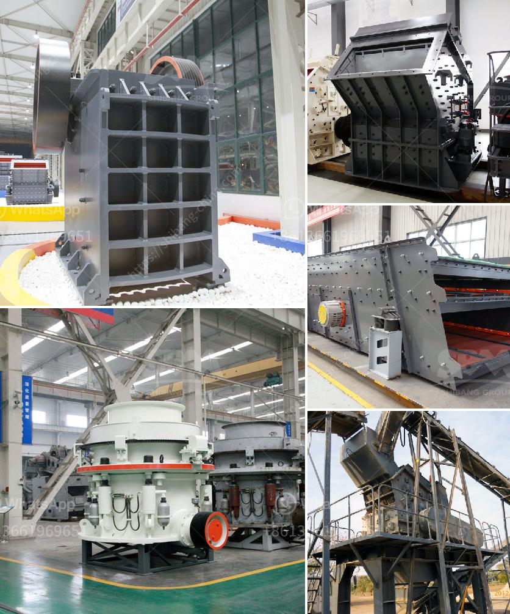

<h3>jaw crusher harga</h3>
Jaw crusher harga is an important part of the mining industry as it is a necessary tool in the processing of various stones and minerals. Also, jaw crusher harga is used in the recycling of waste materials such as concrete, asphalt, and bricks since it can break down the waste substances into certain sizes which can be easily disposed of or recycled.

A jaw crusher is a machine that is mainly used for primary crushing purposes. Typically, the rocks that are extracted from the mines are broken down into smaller pieces with the help of a jaw crusher. Jaw crushers are categorized into two types: single toggle and double toggle. In the single toggle jaw crusher, the swing jaw is suspended on the eccentric shaft, which leads to a much more compact design than that of the double toggle jaw crusher. The swing jaw is moved by a cam or pitman mechanism, acting like a lever, to move the jaw forwards and backwards. On the other hand, the double toggle jaw crusher has two shafts and two toggle plates. The first shaft is a pivoting one, which allows the jaw to move vertically while the other is an eccentric shaft that drives both the jaw plates.

When it comes to purchasing jaw crusher, there are several factors that need to be considered. One of the most important factors is the harga or price of the jaw crusher. Since jaw crushers are available in different sizes and capacities, it is essential to determine the appropriate harga based on the requirements of the mining industry. A jaw crusher with a larger capacity is more expensive than a smaller one, but it can provide better productivity and efficiency in the long run.

Another factor to consider when purchasing a jaw crusher is the quality and durability of the machine. Jaw crushers are subjected to high levels of stress and pressure, which can cause wear and tear on the machine. Therefore, it is crucial to choose a jaw crusher that is made of high-quality materials and is designed to withstand the harsh conditions of the mining industry. A jaw crusher with good quality and durability will require less maintenance and repair work, resulting in reduced downtime and increased productivity.

In conclusion, jaw crusher harga is a vital tool in the mining industry. It is used for primary crushing and recycling of various materials, making it an essential investment for any mining operation. When purchasing a jaw crusher, factors such as harga, capacity, quality, and durability should be taken into consideration to ensure the best value for money. With the right jaw crusher harga, mining companies can efficiently process rocks and minerals, leading to increased productivity and profitability.
<h3>Contact us</h3><ul><li><strong>Whatsapp:&nbsp;<a href="https://wa.me/8613661969651">+8613661969651</a></strong></li><li><a href="https://swt.shibang-china.com/?git&amp;zhl&amp;jaw crusher harga"><strong>Online Service(chat now)</strong></a></li></ul><h3>Related</h3><ul><li><a href='chrome mining equipment and machinery.md'>chrome mining equipment and machinery</a></li><li><a href='silica water washing plant price.md'>silica water washing plant price</a></li><li><a href='service de carbonate de calcium de broyage.md'>service de carbonate de calcium de broyage</a></li><li><a href='dry grinding ball mill.md'>dry grinding ball mill</a></li><li><a href='mobile cil gold processing plant.md'>mobile cil gold processing plant</a></li></ul>