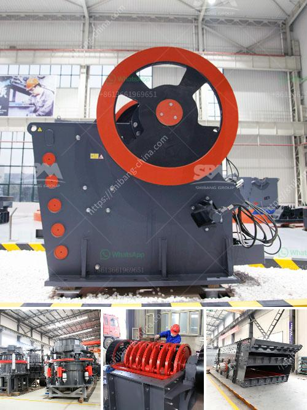

<h3>jaw crusher in germany used</h3>
The development of jaw crusher technology is constantly seeking innovation and reform. At present, the most widely used jaw crusher produced in China has two forms: the jaw crusher with a simple swinging crank and a double rocker mechanism. Simple pendulum jaw crusher; Jaw crusher with complex swinging crank and rocker mechanism.

The former is mostly made into a large size, and works with pe-750×1060 jaw crusher. The latter is mostly made into movable, small jaw crushers. The machine is driven by motor has small volume, saves energy, consumes less power, and saves costs. This equipment adopts wear-resistant materials, which are durable in work and reliable in operation.

The jaw crusher in Germany is simple and easy to operate, and can achieve batch processing. Its inlet is large and its outlet is large, which can process various materials without deformation. It allows easy maintenance and has low cost, which is widely used in mining industry or railway construction field.

The jaw crusher in Germany is widely used in mining, metallurgical industry, building material, highway, railway, and chemical industry. It is mainly used to crush hard and medium hard ores and rocks. The upper and lower crushing jaws operate by the cyclical movement of the movable jaw. The crushing jaws are fast, accurate, and reliable. The crushing mechanism is controlled by the gap between the two jaws, which reduces the amount of dust generated and prolongs the service life of the equipment.

The jaw crusher in Germany has a large crushing ratio. The feeding size is approximately 1,000mm, and the crushing capacity is large. It can crush all kinds of ore materials with compressive strength below 320MPa. Compared with the traditional double-toggle jaw crusher, the German version jaw crusher has larger crushing capacity and lower energy consumption. The main components of a typical jaw crusher are: fixed jaw plate, movable jaw plate, cheek plate, and elbow plate.

As an indispensable part of the crushing process, the jaw crusher plays an important role in the stone crushing field. The jaw crusher reduces the size of large rocks by the compression force between the two jaws. The movable jaw plates are made of high-strength manganese steel and are pre-tested for hardiness and wear resistance. The jaws are of progressive design, meaning they become wider, which increases the crushing chamber's throughput capacity.

The jaw crusher in Germany invest in a high-performance crushing machine with low failure rate, according to the need of crushing users to easily squeeze out the required finished material size. Jaw crusher brand: Jaw crusher manufacturers will also affect the market price of the machine, making competition among jaw crusher suppliers more fierce. Therefore, when buying, users should take more factors into consideration in order to choose cost-effective jaw crushers.

Germany made jaw crusher is characterized by deep crushing cavity. And it can process materials with large crushing ratio. They are mainly used in farms, forests, orchards, crushed and scattered materials. Compared with German-made fixed jaw crushers, German-made jaw crushers have larger crushing capacity and higher output. From the crushing result, jaw crusher is mainly used for coarse crushing operation.

Germany-made jaw crusher is composed of moving jaw plate and fixed jaw plate, which form a crushing cavity similar to the extrusion characteristics of limestone. This kind of jaw crusher has excellent performance in crushing coal. The discharging size is adjustable and has large crushing ratio.

The above article mainly introduces the features and application of jaw crusher in Germany. Please continue to follow us and we will provide you with more professional information.
<h3>Contact us</h3><ul><li><strong>Whatsapp:&nbsp;<a href="https://wa.me/8613661969651">+8613661969651</a></strong></li><li><a href="https://swt.shibang-china.com/?git&amp;zhl&amp;jaw crusher in germany used"><strong>Online Service(chat now)</strong></a></li></ul><h3>Related</h3><ul><li><a href='sand washing plant south africa.md'>sand washing plant south africa</a></li><li><a href='usa stone crushing machines manufacturers.md'>usa stone crushing machines manufacturers</a></li><li><a href='sand making plant china.md'>sand making plant china</a></li><li><a href='kaolin mill machine 400 mesh.md'>kaolin mill machine 400 mesh</a></li><li><a href='paint grinding ball mill.md'>paint grinding ball mill</a></li></ul>