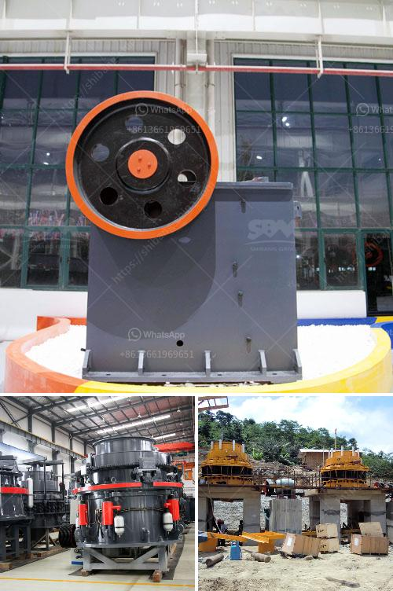

<h3>jaw crusher machine in dubai</h3>
Jaw crusher is a primary crushing machine used for coarse crushing plant in stone quarrying and mine ore mining process. The crushing ratio can reach 4-6 and the fineness of even final product is 10mm - 40 mm. The capacity of small jaw crusher is from 1 t/h- 4 t/h, while the large scale type is 200 TPH - 800 tons per hour.

Jaw crushers are widely applied in areas of mining, metallurgy, construction, smelting, hydraulic and chemical industries, etc. They are used for crushing different materials, such as hard rocks, ore, building rubble, and glass. Jaw crushers have one fixed and one movable crushing jaw that supports the crushing plates. The crushing force is produced through the eccentric shaft, which moves the crushing plates under the action of tension rod and spring. As a result, the angle between the fixed and movable jaw plate increases, causing the materials to be crushed.

The jaw crusher machine in Dubai is recognized as a key stone crushing device in the mining industry. The jaw crusher machine in Dubai is extensively developed in the past decades, with the economy booming, the construction industry has seen immense growth. Both these industries have a great contribution to the GDP of the United Arab Emirates.

With the development of industries and infrastructure projects, the need for jaw crushers is rapidly increasing. The machine is widely used in mining, metallurgy, construction, highway, railway, water conservancy, chemical industry, and many other fields. The construction industry in Dubai is experiencing significant growth, and projects require large amounts of aggregate materials, which are produced by crushing hard rocks with jaw crushers.

The jaw crusher machine in Dubai has the benefits of big crushing ratio, high production capacity, energy saving, and less consumption in the crushing process. It is an ideal crushing machine for crushing hard rocks. In mines, it is used to reduce the size of rock ore or waste materials for easier processing or subsequent crushing.

For construction purposes, the jaw crusher machine in Dubai is used for crushing stones into small pieces to produce fine aggregates. These stones are further used in concrete, asphalt, and other construction materials. The machine has a wide range of applications and is versatile enough to handle various types of rocks and ores.

The jaw crusher machine in Dubai is extensively used in the construction industry and mining industry. It not only ensures the smooth operation of the equipment but also brings a lot of convenience to the construction industry. In the mining industry, it is used to process large amounts of raw materials to improve the efficiency of the mining process.

With the continuous development of the UAE economy, the demand for jaw crusher machines in Dubai has been increasing. The jaw crusher market in the UAE has become demanding due to better technology, quality, and services in the mining and construction industry. This brings growth opportunities to the UAE jaw crusher market.

In conclusion, jaw crusher machine in Dubai plays an important role in the mining and construction industry. The jaw crusher machine has a strong adaptability to various materials and can meet the crushing requirements of various industries. Ultimately, this crusher machine makes a contribution to the UAE economy.
<h3>Contact us</h3><ul><li><strong>Whatsapp:&nbsp;<a href="https://wa.me/8613661969651">+8613661969651</a></strong></li><li><a href="https://swt.shibang-china.com/?git&amp;zhl&amp;jaw crusher machine in dubai"><strong>Online Service(chat now)</strong></a></li></ul><h3>Related</h3><ul><li><a href='silica sand washing process.md'>silica sand washing process</a></li><li><a href='quarry crusher equipment process.md'>quarry crusher equipment process</a></li><li><a href='ball mill for manufacturing.md'>ball mill for manufacturing</a></li><li><a href='mobile crushing plant for sale.md'>mobile crushing plant for sale</a></li><li><a href='turkey cone crusher.md'>turkey cone crusher</a></li></ul>