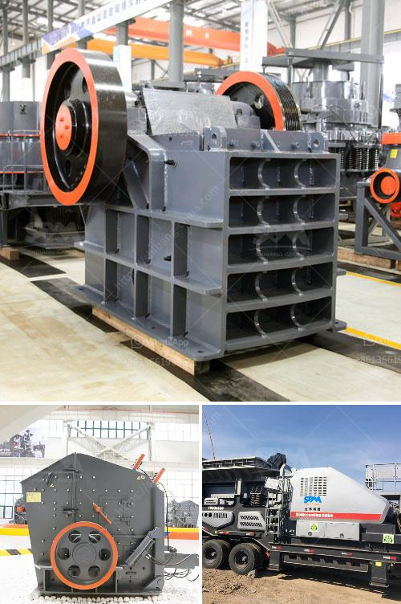

<h3>jaw crusher machine in south africa</h3>
The jaw crusher machine, also known as the primary crusher, is one of the most efficient and effective machines for crushing stones and minerals. It is widely used in mining, metallurgy, chemical industry, building materials, electric power, transportation and other industries to reduce large stones into small stones or gravel.

In South Africa, the jaw crusher machine is mainly used in mineral processing, building materials, transportation and other industries. Jaw crusher machine plays an important role in the rapid development of mining machinery industry in South Africa. With the continuous development of scientific and technological level, the country's overall industrial level has been greatly improved, resulting in the continuous improvement of jaw crusher machine performance.

The jaw crusher machine has simple structure, convenient operation, reliable performance and low operating cost. It is mainly composed of two jaw plates, a connecting rod, a flywheel, a regulating device and a safety device. The crushing chamber is composed of a fixed jaw plate and a movable jaw plate. When the jaw crusher machine is working, the motor drives the belt and pulley to move the movable jaw up and down through the eccentric shaft. When the movable jaw rises, the angle between the toggle plate and the movable jaw becomes larger, which pushes the movable jaw plate closer to the fixed jaw plate, and the material is crushed or broken under the action of the squeezing, impacting and bending of the two jaw plates.

In addition, the jaw crusher machine in South Africa can adjust the discharge opening of the inlet and outlet to achieve the required particle size. Jaw crusher machine maintenance and repair services should be done regularly, as the shutdown time increases, the production efficiency will be greatly reduced. Therefore, regular maintenance and repairing is necessary.

In conclusion, the jaw crusher machine in South Africa is mainly used for coarse crushing and medium crushing in the fields of mining, building materials, infrastructure construction and so on. It has been widely used in South African mines, quarries and other industries, providing a steady output of materials for the development of the country's economy and creating huge economic benefits.
<h3>Contact us</h3><ul><li><strong>Whatsapp:&nbsp;<a href="https://wa.me/8613661969651">+8613661969651</a></strong></li><li><a href="https://swt.shibang-china.com/?git&amp;zhl&amp;jaw crusher machine in south africa"><strong>Online Service(chat now)</strong></a></li></ul><h3>Related</h3><ul><li><a href='crusher machine supplier malaysia.md'>crusher machine supplier malaysia</a></li><li><a href='marble powder mill machinery.md'>marble powder mill machinery</a></li><li><a href='sample business plan for stone crusher.md'>sample business plan for stone crusher</a></li><li><a href='iron ore upgrading plant equipment.md'>iron ore upgrading plant equipment</a></li><li><a href='africa sand washing plant for rent and sale.md'>africa sand washing plant for rent and sale</a></li></ul>