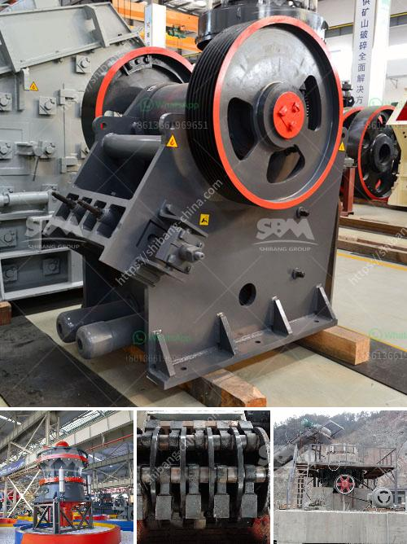

<h3>jaw crusher machine supplier</h3>
In recent years, the demand for jaw crusher machines is increasing in mining, construction, and other industries. Every jaw crusher machine supplier is the same, but not all manufacturers can be trusted. Therefore, it is essential to take the time to choose a reliable supplier to ensure the machine's quality and durability.

When searching for a jaw crusher machine supplier, there are a few key factors to consider. The first and foremost is the machine's quality. A high-quality jaw crusher machine will deliver reliable performance for crushing various materials. It should be made of durable materials, such as cast iron and steel, to ensure maximum strength and longevity.

The next factor to consider is the supplier's reputation. A reputable supplier will have a history of delivering high-quality products and excellent customer service. They will also have positive reviews and feedback from their previous clients. To check the supplier's reputation, you can search for online reviews, visit their website, or ask for referrals from industry professionals.

Another crucial aspect to consider is the supplier's after-sales service. A reliable supplier should offer comprehensive after-sales support, including installation, training, and maintenance. They should also provide a warranty for their machines, ensuring that any defects or breakdowns will be promptly addressed.

The price of the jaw crusher machine is also an important consideration. While you should never compromise on quality, it is essential to find a supplier that offers competitive pricing. Comparing prices from multiple suppliers can help you determine the market average and avoid overpaying. However, remember that the cheapest option may not always be the best choice, as it may compromise quality and reliability.

One reliable jaw crusher machine supplier that ticks all the boxes is XYZ Machinery. XYZ Machinery has been manufacturing and supplying jaw crushers for decades. Their machines are known for their reliability, durability, and excellent performance.

XYZ Machinery offers a wide range of jaw crusher machines to cater to diverse crushing needs. Whether it's for mining, construction, or recycling applications, they have the right machine for the job. Their jaw crushers are designed with advanced technology and precision engineering to ensure optimal performance and efficiency.

In addition to their top-quality machines, XYZ Machinery also provides excellent after-sales service. They have a team of experienced technicians who can install and train your staff on how to use and maintain the jaw crusher machine. They also offer prompt support and assistance in case of any issues.

Furthermore, XYZ Machinery offers competitive pricing without compromising on quality. They aim to provide value for money and establish long-term partnerships with their clients. With XYZ Machinery as your jaw crusher machine supplier, you can trust that you are getting a reliable and high-quality product.

In conclusion, choosing the right jaw crusher machine supplier is crucial to ensure that you get a high-quality and reliable machine. Consider factors such as machine quality, supplier reputation, after-sales service, and pricing. XYZ Machinery is a reliable supplier that offers top-quality jaw crusher machines, excellent customer service, and competitive pricing. With their expertise and commitment to customer satisfaction, XYZ Machinery is your ideal partner in crushing practices.
<h3>Contact us</h3><ul><li><strong>Whatsapp:&nbsp;<a href="https://wa.me/8613661969651">+8613661969651</a></strong></li><li><a href="https://swt.shibang-china.com/?git&amp;zhl&amp;jaw crusher machine supplier"><strong>Online Service(chat now)</strong></a></li></ul><h3>Related</h3><ul><li><a href='crusher plants in pakistan.md'>crusher plants in pakistan</a></li><li><a href='wet and dry ball mill.md'>wet and dry ball mill</a></li><li><a href='cement process plant crushing machines manufacturer.md'>cement process plant crushing machines manufacturer</a></li><li><a href='portable stone crusher for sale india price.md'>portable stone crusher for sale india price</a></li><li><a href='crusher and screen for sale philippines.md'>crusher and screen for sale philippines</a></li></ul>