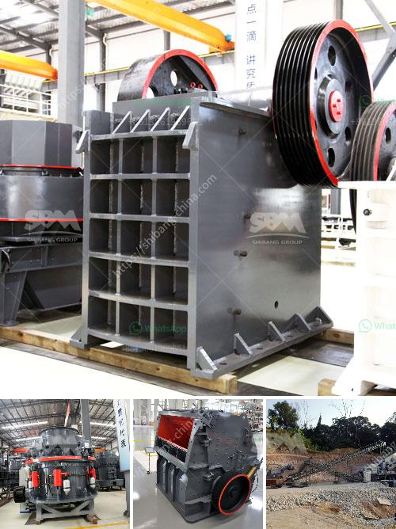

<h3>jaw crusher machinery</h3>
A jaw crusher essentially crushes large rocks to a more usable size. They’re typically the first-line machinery used in the material reduction for several applications. This includes rock quarries, sand and gravel, construction aggregates, metallurgy, and chemical industries.

Jaw crushers offer reduction ratios of up to about 6:1, while cone crushers can reduce material size up to a maximum of 8:1 ratio. The finer the crushing, the smaller the reduction ratio. As a basic rule, jaw crushers are the primary crusher taking the mined aggregate and reducing it to a size that a cone crusher can accept. Cone crushers tend to be the secondary crusher, and usually produce material of a size needed for many industry applications such as the aggregates needed for asphalt and concrete production. For the most part, the greater the reduction ratio, the lower the finished product.

Jaw crushers are essential tools for the mining and construction industries. With the rapid growth experienced by these industries over the past decades, it is no secret that the demand for stone is increasing faster than ever. Moreover, with the rising demand for aggregate materials, the requirement for crushing equipment is likewise on the rise.

The jaw crusher machine is not limited to the mining industry alone. Although it has made a name for itself in mining, construction, and infrastructure projects, the jaw crusher has also found use in the recycling industry, making the jaw crusher a versatile piece of machinery.

One of the key factors that should be taken into account when choosing a jaw crusher is the material strength, which determines the durability and longevity of the equipment. The strength of the material to be crushed determines the necessary maximum reduction ratio and the capacity of the machine.

Furthermore, the overall size and weight of the machine play a significant role. While the jaw crusher is compact enough to maneuver easily across different job sites, its size and weight make it ideal for transportation between sites.

Another attribute of the jaw crusher is its ability to transport the material to the next stage. This highly efficient process eliminates the need for additional equipment, such as a primary scalper and a separate conveyor for the crushed material.

Safety is also a crucial factor when using a jaw crusher. Proper maintenance, regular inspections, and adherence to safety protocols are essential to ensure the safety of operators. Modern jaw crushers are equipped with advanced safety devices, such as hydraulic systems that support the safety of the operator and minimize potential hazards.

In conclusion, the jaw crusher machinery is a piece of versatile equipment that is both practical and reliable, offering an efficient and reliable crushing solution for a wide range of materials and applications. Its ability to support heavy loads and high reduction ratios make it an attractive option for industries where material size reduction is essential. From mining to recycling and construction, jaw crushers play a key role in enhancing productivity and meeting the demands of various industries.
<h3>Contact us</h3><ul><li><strong>Whatsapp:&nbsp;<a href="https://wa.me/8613661969651">+8613661969651</a></strong></li><li><a href="https://swt.shibang-china.com/?git&amp;zhl&amp;jaw crusher machinery"><strong>Online Service(chat now)</strong></a></li></ul><h3>Related</h3><ul><li><a href='grinding mills in pakistan.md'>grinding mills in pakistan</a></li><li><a href='rock crushing plant for sale.md'>rock crushing plant for sale</a></li><li><a href='crushing equipment south africa crusher quotes.md'>crushing equipment south africa crusher quotes</a></li><li><a href='limestone rock crushing.md'>limestone rock crushing</a></li><li><a href='crushing complete crushing plant 150tph 200tph.md'>crushing complete crushing plant 150tph 200tph</a></li></ul>