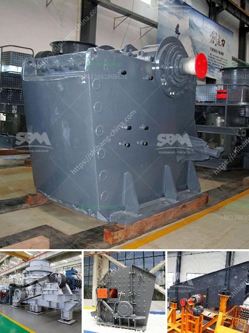

<h3>jaw crusher mem fr90</h3>
The jaw crusher MEM FR90 is a powerful machine that is used for the crushing of oversized materials. It is often used in a variety of industries such as mining, metallurgy, building materials, and chemical industries. With an adjustable outlet size ranging from 40mm to 120mm, this machine can meet the crushing requirements of various materials.

The MEM FR90 jaw crusher is characterized by its simple design, ease of use, and low maintenance requirements. It is equipped with a robust frame and a moving jaw that is driven by an electric motor. The crushing mechanism is made up of two manganese jaws, which are kept in place by a pitman arm. The material is fed into the chamber through an opening at the top and is crushed between the stationary and moving jaws.

One of the key features of the MEM FR90 is its high crushing capacity. With a maximum feeding size of up to 600mm and a production capacity of 80-100 ton per hour, this machine can efficiently crush large quantities of material in a short period of time. It is suitable for both primary and secondary crushing, making it a versatile choice for a wide range of applications.

Another advantage of the MEM FR90 is its energy efficiency. The electric motor consumes less power compared to other types of crushers, resulting in lower operating costs. Additionally, the machine operates at a relatively low noise level, making it suitable for use in noise-sensitive environments.

The maintenance requirements of the MEM FR90 are also minimal. The machine is designed with durable components that are built to withstand heavy-duty use. The jaws are made of high-quality manganese steel, which provides excellent wear resistance and long service life. The machine also incorporates an automatic lubrication system, which ensures proper lubrication of all moving parts, reducing the risk of breakdowns and prolonging the lifespan of the machine.

In terms of safety, the MEM FR90 is equipped with various safety features. A safety lever is provided on the side of the machine, which allows the operator to stop the machine immediately in case of an emergency. The machine is also equipped with a safety plate that prevents any accidental opening of the chamber during operation.

In conclusion, the MEM FR90 jaw crusher is a reliable and efficient machine that is perfect for the crushing of oversized materials. Its high capacity, energy efficiency, low maintenance requirements, and safety features make it a valuable asset in various industries. Whether used for primary or secondary crushing, this machine delivers consistent and high-quality results.
<h3>Contact us</h3><ul><li><strong>Whatsapp:&nbsp;<a href="https://wa.me/8613661969651">+8613661969651</a></strong></li><li><a href="https://swt.shibang-china.com/?git&amp;zhl&amp;jaw crusher mem fr90"><strong>Online Service(chat now)</strong></a></li></ul><h3>Related</h3><ul><li><a href='stone crusher machine price list in bangladesh.md'>stone crusher machine price list in bangladesh</a></li><li><a href='cement process plant crushing machines manufacturer.md'>cement process plant crushing machines manufacturer</a></li><li><a href='ball mill with high quality and best price.md'>ball mill with high quality and best price</a></li><li><a href='clinker roller crusher manufacturers.md'>clinker roller crusher manufacturers</a></li><li><a href='rock crusher sale.md'>rock crusher sale</a></li></ul>