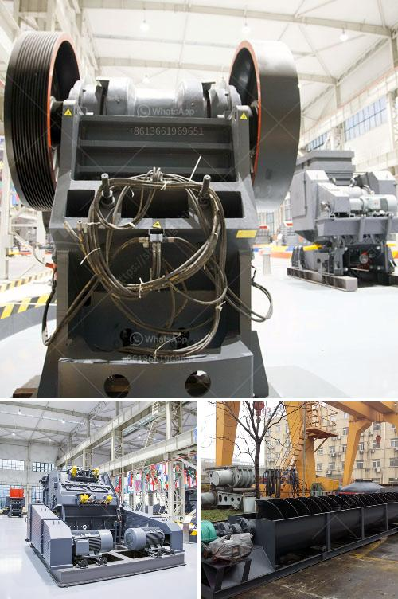

<h3>jaw crusher moby</h3>
The jaw crusher Moby is a highly versatile machine that allows for efficient and effective crushing of materials. With its hydraulic adjustment system, it is easily adjustable to suit different crushing applications. The Moby jaw crusher is characterized by its rugged design and high performance capabilities.

One of the key features of the Moby jaw crusher is its ability to handle tough materials. The machine's innovative design allows for efficient crushing of various types of materials, including concrete, asphalt, and other construction debris. This makes it an ideal choice for construction projects and quarrying operations.

The hydraulic adjustment system of the Moby jaw crusher enables quick and easy adjustment of the crusher's settings. The user can choose between different settings depending on the material being crushed and the desired end product. This flexibility makes the Moby jaw crusher suitable for a wide range of applications, from primary crushing to secondary and tertiary crushing.

In addition to its adjustable settings, the Moby jaw crusher also features a large feed opening. This allows for high-capacity crushing and ensures that the machine can handle even the largest rocks or chunks of material. The large feed opening also reduces the risk of bridging, which can occur when materials become jammed in the crusher's throat.

Another advantage of the Moby jaw crusher is its compact size. Despite its high performance capabilities, the machine has a relatively small footprint, making it easy to transport and maneuver on-site. This is particularly beneficial for contractors who need to move the crusher between different job sites.

The Moby jaw crusher also boasts a high level of operator comfort and safety. The machine is equipped with a number of safety features to protect the operator during operation. These include a protective housing to prevent debris from entering the crusher, as well as a safety interlock system that ensures the crusher cannot be operated when the access doors are open.

Overall, the Moby jaw crusher is a highly versatile and efficient machine that offers a range of benefits for crushing applications. Its rugged design, hydraulic adjustment system, and high capacity make it suitable for a variety of materials and applications. Whether used in construction projects, quarrying operations, or recycling applications, the Moby jaw crusher is a reliable and effective choice.
<h3>Contact us</h3><ul><li><strong>Whatsapp:&nbsp;<a href="https://wa.me/8613661969651">+8613661969651</a></strong></li><li><a href="https://swt.shibang-china.com/?git&amp;zhl&amp;jaw crusher moby"><strong>Online Service(chat now)</strong></a></li></ul><h3>Related</h3><ul><li><a href='grinding machine specification india price.md'>grinding machine specification india price</a></li><li><a href='mobile crusher in fiji.md'>mobile crusher in fiji</a></li><li><a href='iron ore magnetic separation from titanium process.md'>iron ore magnetic separation from titanium process</a></li><li><a href='cone crusher manufacturers in usa.md'>cone crusher manufacturers in usa</a></li><li><a href='nigeria jaw crusher.md'>nigeria jaw crusher</a></li></ul>