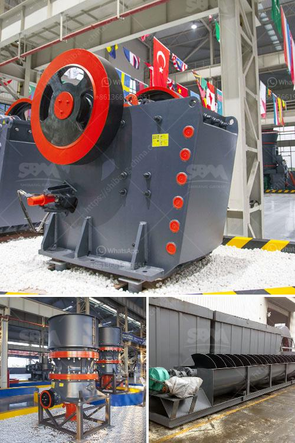

<h3>jaw crusher plant</h3>
A jaw crusher plant is a versatile machine that can be used for crushing that is used for processing rocks and minerals. It is the best choice for efficient and reliable primary crushing of hard and brittle materials, including granite, basalt, limestone, and even recycled concrete.

The jaw crusher plant is designed to provide the utmost reliability, exceptional durability, and a high level of productivity. With a variety of features and customizable options, this plant is the perfect solution for any crushing application.

One of the key features of a jaw crusher plant is its powerful crushing capacity. The machine is equipped with a high-performance jaw crusher that can break down even the hardest rock materials into smaller pieces. This ensures that the plant can handle large volumes of material, making it perfect for processing aggregates, construction waste, and even ores.

In addition to its powerful crushing capabilities, the jaw crusher plant is also highly efficient. It has a high output capacity, meaning that it can process large amounts of material in a short amount of time. This not only saves time and labor costs but also increases overall productivity.

The jaw crusher plant is also designed with ease of operation in mind. It features user-friendly controls and a simple layout that makes it easy to operate and maintain. This means that operators can quickly learn how to use the machine and carry out routine maintenance without any hassle.

Furthermore, the jaw crusher plant is built to last. It is constructed with high-quality materials and robust components that can withstand even the most demanding conditions. This ensures that the plant will continue to perform efficiently and reliably, even in harsh environments such as construction sites or quarries.

Another advantage of the jaw crusher plant is its compact design. Unlike other crushing machines, this plant has a small footprint, making it suitable for use in tight spaces. It can be easily transported to different locations, saving time and money on logistics.

The jaw crusher plant also offers a range of customizable options. This means that customers can choose the configuration that best suits their specific needs. Whether it is a primary crushing plant or a secondary crushing plant, the jaw crusher plant can be tailored to meet the exact requirements of the application.

In conclusion, a jaw crusher plant is an excellent choice for efficient and reliable primary crushing. With its powerful crushing capabilities, high output capacity, and ease of operation, this machine offers enhanced performance for a wide range of applications. Whether it is used in quarries, construction sites, or recycling facilities, the jaw crusher plant can handle the toughest materials with ease. Invest in a jaw crusher plant and experience efficient crushing like never before.
<h3>Contact us</h3><ul><li><strong>Whatsapp:&nbsp;<a href="https://wa.me/8613661969651">+8613661969651</a></strong></li><li><a href="https://swt.shibang-china.com/?git&amp;zhl&amp;jaw crusher plant"><strong>Online Service(chat now)</strong></a></li></ul><h3>Related</h3><ul><li><a href='crushing and screening of manganese ore.md'>crushing and screening of manganese ore</a></li><li><a href='advantages of single toggle jaw crusher.md'>advantages of single toggle jaw crusher</a></li><li><a href='how is calcite used to manufacture paper.md'>how is calcite used to manufacture paper</a></li><li><a href='smallfine powder grinding machine nigeria.md'>smallfine powder grinding machine nigeria</a></li><li><a href='iron ore crusher machine.md'>iron ore crusher machine</a></li></ul>