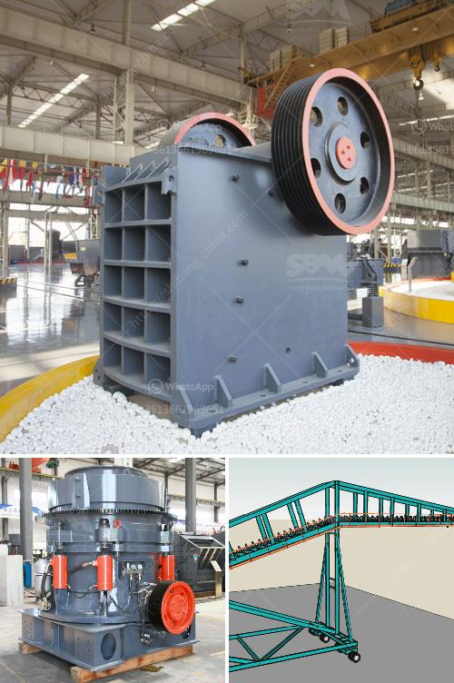

<h3>jaw crusher price capacity</h3>
When it comes to purchasing a jaw crusher, there are several important factors to consider. One of the most crucial elements is the price capacity of the machine. Understanding this aspect can help you make an informed decision and ensure that you invest in a jaw crusher that meets your requirements.

Price and capacity are interrelated when it comes to jaw crushers. Generally, a jaw crusher with higher capacity is more expensive as it has the ability to process more materials at a time. However, the cost might be justified if the crusher can effectively handle larger quantities of rocks, stones, or minerals, leading to increased productivity and higher profitability.

The capacity of a jaw crusher is measured in terms of the maximum amount of material it can process in a given timeframe. This parameter is essential as it determines the efficiency and performance of the machine. If the capacity is too low, you may need to constantly halt the crushing process to clear the machine, resulting in downtime and reduced output.

In the context of jaw crusher price capacity, it is important not to solely focus on the maximum capacity. Instead, consider your specific requirements and the average workload you anticipate. A jaw crusher with a higher capacity might be unnecessary if you only need to process smaller amounts of material. In such cases, opting for a machine with a lower price capacity could be a cost-effective solution.

On the other hand, if you have a high-volume operation or expect an increase in demand, investing in a jaw crusher with a larger capacity might be a wise decision. While the upfront cost may be higher, the long-term benefits of improved productivity and reduced downtime could outweigh the initial investment.

Ultimately, choosing the right jaw crusher involves finding the balance between price and capacity. It is essential to evaluate your specific needs, taking into account factors such as the type of material, desired output size, and production volume. By doing so, you can make an informed decision and select a jaw crusher that offers the optimum combination of price and capacity, ensuring efficient and profitable operations for your business.
<h3>Contact us</h3><ul><li><strong>Whatsapp:&nbsp;<a href="https://wa.me/8613661969651">+8613661969651</a></strong></li><li><a href="https://swt.shibang-china.com/?git&amp;zhl&amp;jaw crusher price capacity"><strong>Online Service(chat now)</strong></a></li></ul><h3>Related</h3><ul><li><a href='roller mill in china.md'>roller mill in china</a></li><li><a href='mining equipment for sale zimbabwe.md'>mining equipment for sale zimbabwe</a></li><li><a href='jaw crusher typex.md'>jaw crusher typex</a></li><li><a href='metal detector for iron ore crushing plant.md'>metal detector for iron ore crushing plant</a></li><li><a href='barytes pulverizer equipment.md'>barytes pulverizer equipment</a></li></ul>