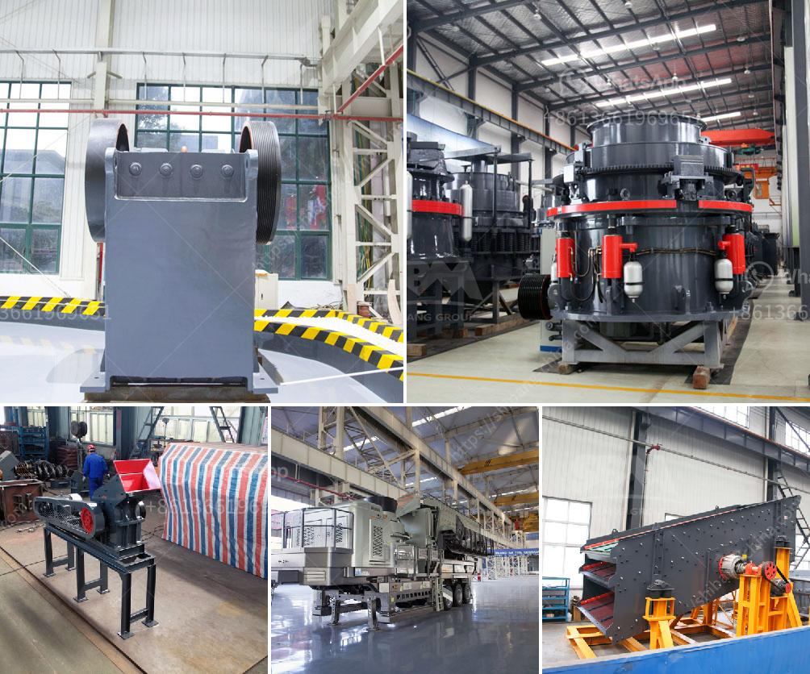

<h3>jaw crusher price</h3>
A jaw crusher is an indispensable equipment in the mining industry. It is used to break large stones into small particles, making them suitable for further processing. The jaw crusher has a simple structure, reliable operation, and low operating costs. However, the jaw crusher price still varies greatly due to different factors. This article will provide a detailed explanation of the jaw crusher price.

First and foremost, the jaw crusher price is affected by factors such as the model, capacity, and quality of the equipment. Different manufacturers produce jaw crushers of different qualities and capacities, which leads to differences in prices. Commonly available in the market are PE jaw crushers, PEX jaw crushers, and HD jaw crushers. The PE jaw crusher is used for coarse crushing, PEX jaw crusher for medium and fine crushing, and HD jaw crusher for high-end applications. The jaw crusher capacity generally ranges from 1 to 1000 tons per hour. The larger the capacity, the higher the price.

Secondly, the jaw crusher price is also influenced by the manufacturing cost. Generally, jaw crushers with higher manufacturing costs have better performance and more reliable quality. Therefore, jaw crushers produced by large-scale manufacturers are usually more expensive than those produced by small manufacturers. In addition, the manufacturing cost also includes the cost of raw materials, labor, and transportation, which further affects the overall jaw crusher price.

Another important factor is the market demand. When the market demand for jaw crushers is high and the supply is limited, the price tends to be higher. On the other hand, when the supply exceeds the demand, the price may be lower. Therefore, understanding the market demand is also crucial in determining the jaw crusher price. Additionally, changes in macroeconomic factors, such as inflation and exchange rates, can also affect the price of jaw crushers.

Moreover, after-sales service is an important consideration for buyers. A reliable after-sales service can provide technical support, equipment maintenance, and spare parts replacement in a timely manner. However, providing comprehensive after-sales service requires additional costs, which may affect the jaw crusher price. Buyers should consider the reputation of the manufacturer in terms of after-sales service to ensure a good user experience and minimize future costs.

Lastly, geographical factors can also impact the jaw crusher price. Different countries or regions may have different production costs, labor costs, and transportation costs, which ultimately affect the final price of the jaw crusher. Buyers may need to take into account the import or export expenses when comparing prices from different suppliers.

In conclusion, the jaw crusher price is determined by various factors, including the model, capacity, quality, manufacturing cost, market demand, after-sales service, and geographical factors. Buyers should carefully evaluate these aspects to make an informed decision regarding their investment. It is advisable to compare prices from different manufacturers and consider factors beyond the initial cost, such as long-term maintenance and customer service. By doing so, buyers can select a cost-effective jaw crusher that meets their requirements and ensures smooth operation in their mining operations.
<h3>Contact us</h3><ul><li><strong>Whatsapp:&nbsp;<a href="https://wa.me/8613661969651">+8613661969651</a></strong></li><li><a href="https://swt.shibang-china.com/?git&amp;zhl&amp;jaw crusher price"><strong>Online Service(chat now)</strong></a></li></ul><h3>Related</h3><ul><li><a href='cost of a stone crusher machine.md'>cost of a stone crusher machine</a></li><li><a href='europe conveyor belts manufacturer.md'>europe conveyor belts manufacturer</a></li><li><a href='raymond mill for grinding gypsum.md'>raymond mill for grinding gypsum</a></li><li><a href='used sand wash equipment.md'>used sand wash equipment</a></li><li><a href='pebble and basalt production line in panama.md'>pebble and basalt production line in panama</a></li></ul>