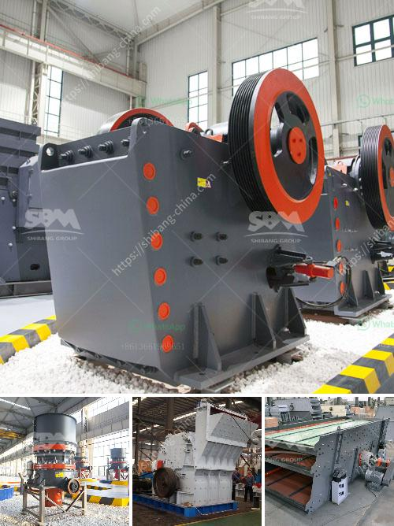

<h3>jaw crusher quotes</h3>
Crushing is an essential process in various industries such as mining, construction, and recycling. It enables the extraction of valuable minerals from the Earth and aids in producing materials for building and infrastructure projects. Jaw crushers play a crucial role in this process, as they are responsible for reducing the size of large rocks and ores into smaller, more manageable pieces. To showcase the significance of jaw crusher quotes, let us delve into their various applications and advantages.

First and foremost, jaw crushers are highly versatile machines that can handle a wide range of materials. From soft to hard rock, they can effortlessly crush stones, ores, and minerals into the desired size. This adaptability makes them an integral part of many industries. Whether it is limestone, granite, or even concrete, jaw crushers can handle it all.

In addition to their versatility, jaw crushers offer numerous advantages over other crushing machines. One of the key benefits is their high efficiency. With a simple design and powerful crushing capabilities, jaw crushers have the ability to process large quantities of material quickly. This results in increased productivity and reduced operational costs for companies.

Furthermore, jaw crushers are known for their reliability and durability. Built with robust materials and components, they can endure the harshest operating conditions. This ensures a long lifespan and minimal maintenance requirements. With proper care and maintenance, a jaw crusher can serve a company for many years, providing a reliable and consistent source of crushing power.

To assist companies in finding the right jaw crusher for their specific needs, various manufacturers and suppliers offer quotes and specifications. These jaw crusher quotes provide essential information about the machine's features, dimensions, capacities, and power requirements. Companies can compare these quotes to identify the most suitable jaw crusher for their operations.

Moreover, jaw crusher quotes allow companies to consider additional features and optional extras. For example, some jaw crushers come with advanced hydraulic systems that facilitate easy and safe adjustment of the crusher's setting. This ensures optimal performance and reduces the risk of damage to the machine. Similarly, companies can explore options such as increased feed openings, heavy-duty frames, and enhanced wear parts to further enhance their operations.

In conclusion, jaw crusher quotes are invaluable in unlocking the potential of crushing. Jaw crushers are essential for various industries, enabling the extraction of valuable minerals and producing materials for construction projects. They offer high efficiency, reliability, and durability, making them an excellent choice for companies. By considering jaw crusher quotes, companies can find the most suitable machine for their specific needs, ensuring optimal performance and maximizing their return on investment. So, let the quotes guide you towards a more efficient and productive crushing process.
<h3>Contact us</h3><ul><li><strong>Whatsapp:&nbsp;<a href="https://wa.me/8613661969651">+8613661969651</a></strong></li><li><a href="https://swt.shibang-china.com/?git&amp;zhl&amp;jaw crusher quotes"><strong>Online Service(chat now)</strong></a></li></ul><h3>Related</h3><ul><li><a href='graphite ore beneficiation.md'>graphite ore beneficiation</a></li><li><a href='project report for starting a crusher plant in tamilnadu.md'>project report for starting a crusher plant in tamilnadu</a></li><li><a href='crushing complete crushing plant 150tph 200tph.md'>crushing complete crushing plant 150tph 200tph</a></li><li><a href='hammer mill 150 250.md'>hammer mill 150 250</a></li><li><a href='second hand ball mill europe.md'>second hand ball mill europe</a></li></ul>