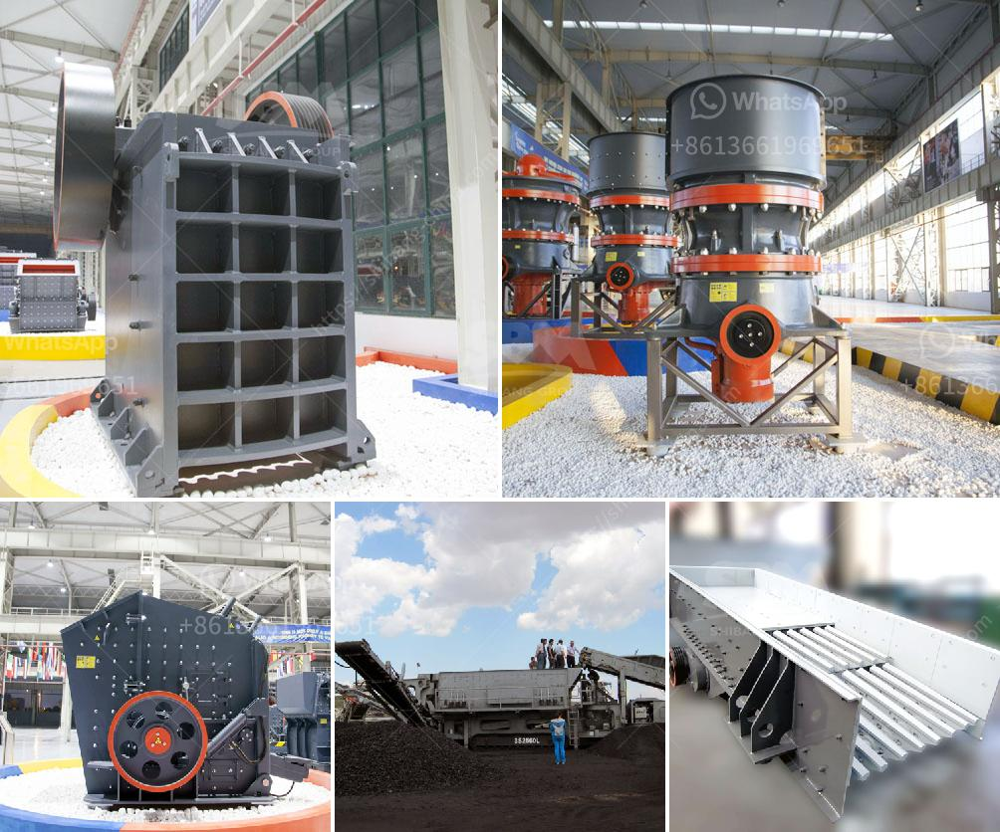

<h3>jaw crusher size</h3>
The jaw crusher is one of the most commonly used equipment for crushing stones and minerals. It has a strong crushing ability and can efficiently crush materials of various hardness levels with a maximum feed size of 125-1200mm. This makes it an ideal choice for primary crushing applications in quarries, mines, and construction sites.

One of the most important factors to consider when choosing a jaw crusher is the size of the machine. Different jaw crushers have different specifications and each type of crusher has its own unique features. In general, larger crushers are more powerful and capable of processing larger materials. However, they also tend to be more expensive and require more space.

For many applications, a jaw crusher with a size in the range of 300-500mm is sufficient. This size allows for efficient crushing of both hard and soft materials, ensuring high productivity and low operating costs. Additionally, a smaller jaw crusher can also be operated in a closed circuit, reducing the need for additional screens or conveyors to handle oversized materials.

The choice of jaw crusher size also depends on the anticipated production requirements. If a higher production rate is desired, a larger crusher with a higher motor power and a larger feed opening can be selected. This enables the crusher to process a greater amount of material in a shorter time, resulting in increased productivity.

On the other hand, if the focus is on achieving a finer product size, a smaller crusher with a smaller feed opening can be chosen. This allows for a tighter setting, which produces smaller product sizes. A smaller crusher is also easier to control and adjust, making it suitable for applications where precise control over the final product is required.

In addition to size, other factors such as the type of material being crushed, the required product size, and the desired capacity should also be considered when selecting a jaw crusher. It is important to choose a crusher that can handle the specific requirements of the application and deliver the desired output.

In conclusion, the size of a jaw crusher plays a crucial role in determining the efficiency and performance of the crushing process. A crusher with a size in the range of 300-500mm is ideal for most crushing applications, as it can efficiently crush both hard and soft materials while offering high productivity and low operating costs. However, it is important to consider other factors such as the type of material, desired product size, and required capacity to select the most suitable crusher for a specific application.
<h3>Contact us</h3><ul><li><strong>Whatsapp:&nbsp;<a href="https://wa.me/8613661969651">+8613661969651</a></strong></li><li><a href="https://swt.shibang-china.com/?git&amp;zhl&amp;jaw crusher size"><strong>Online Service(chat now)</strong></a></li></ul><h3>Related</h3><ul><li><a href='chinese jaw crusher.md'>chinese jaw crusher</a></li><li><a href='slag crusher plant manufacturer india.md'>slag crusher plant manufacturer india</a></li><li><a href='used stone crusher for sale in india.md'>used stone crusher for sale in india</a></li><li><a href='jaw rock crusher price by owner.md'>jaw rock crusher price by owner</a></li><li><a href='zircon sand mining companies list in canada.md'>zircon sand mining companies list in canada</a></li></ul>