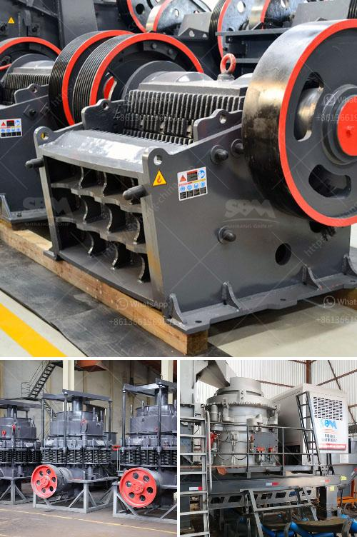

<h3>jaw crusher specification for activated carbon</h3>
Activated carbon is one of the most widely used materials for gas and water purification. It is made from carbonaceous materials such as wood, coal, coconut shell, and peat. Besides its excellent adsorption capacity, activated carbon also has the ability to remove impurities and contaminants from various substances. In the manufacturing process of activated carbon, a jaw crusher is crucial equipment for crushing the materials to a suitable size.

Jaw crusher is commonly used as the primary crusher, and it is essential to carefully consider its parameters since it affects the quality and efficiency of the activated carbon product. One key parameter is the jaw crusher specification known as the feeding opening size. This directly impacts the selection of the feeding equipment, such as feeders and screens. A large-sized jaw crusher with an opening size of 750mm or above is typically used for large-scale projects to prevent blockage and achieve higher productivity.

Another important specification is the width of the discharge opening. This determines the size of the crushed material and the final product granularity. For activated carbon applications, an adjustable discharge opening width is preferred to control the product size effectively. This allows for flexibility in meeting the specific requirements of different customers and applications.

Crushing capacity is yet another crucial specification to consider. It is usually measured in tons per hour and determines the amount of material that can be processed in a given time. A higher crushing capacity ensures more efficient production and shorter processing times, which is especially important in large-scale activated carbon production.

An often overlooked but important specification is the power of the jaw crusher. The power directly affects the energy consumption and operating costs. A higher power rating allows for faster and more efficient crushing, reducing the overall energy consumption and optimizing the production process. However, the appropriate power rating should be chosen based on the specific application requirements while considering the overall cost-benefit analysis.

In addition to these key specifications, other factors also play a role in determining the ideal jaw crusher for activated carbon. The material hardness, moisture content, and abrasiveness should be considered to select the proper wear-resistant materials for the jaw plate and crushing chamber. This ensures longer service life and reduces the need for frequent replacements, thereby reducing downtime and maintenance costs.

Furthermore, the design and structure of the jaw crusher should also be considered. A well-designed jaw crusher with a sturdy structure and proper sealing system can effectively prevent dust and noise pollution, enhancing the working environment and complying with environmental regulations.

In summary, selecting the appropriate jaw crusher specification for activated carbon is crucial to ensure the quality and efficiency of the final product. Factors such as feeding opening size, discharge opening width, crushing capacity, power rating, and material properties should all be carefully considered. Furthermore, the design and structure of the crusher must promote efficient and environmentally friendly operation. With the right specifications and considerations, a jaw crusher can contribute significantly to the success of activated carbon production.
<h3>Contact us</h3><ul><li><strong>Whatsapp:&nbsp;<a href="https://wa.me/8613661969651">+8613661969651</a></strong></li><li><a href="https://swt.shibang-china.com/?git&amp;zhl&amp;jaw crusher specification for activated carbon"><strong>Online Service(chat now)</strong></a></li></ul><h3>Related</h3><ul><li><a href='crusher prices stone crusher.md'>crusher prices stone crusher</a></li><li><a href='used stone crasher machine for sale.md'>used stone crasher machine for sale</a></li><li><a href='jaw crusher moby.md'>jaw crusher moby</a></li><li><a href='low cost jaw crusher for sale in ethiopia.md'>low cost jaw crusher for sale in ethiopia</a></li><li><a href='screw conveyor blade calculation.md'>screw conveyor blade calculation</a></li></ul>