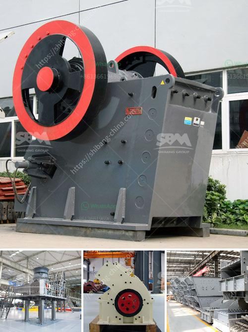

<h3>jaw crusher supplier of new zealand</h3>
In the past decade, New Zealand has seen an increase in demand for crushers, particularly jaw crushers. A jaw crusher supplier in New Zealand is responsible for delivering reliable and durable jaw crushers that can meet the challenges placed by various demands of the construction and mining industries.

The jaw crusher supplier of New Zealand offers a range of jaw crushers that can be customized to suit the unique requirements of your project. These highly-adaptable machines eliminate the need for time-consuming reconfiguration, allowing you to meet changing demands promptly and efficiently.

The jaw crusher supplier of New Zealand focuses on delivering high-quality and reliable equipment to ensure long-lasting performance. Each jaw crusher undergoes rigorous testing before it is made available to customers, ensuring that it meets the highest quality standards. Moreover, these crushers are manufactured using state-of-the-art technology, guaranteeing their efficiency and durability.

Whether you are involved in mining, construction, or recycling, the jaw crusher supplier of New Zealand can offer a jaw crusher that can efficiently handle a wide range of applications. From primary crushing to secondary and tertiary crushing, these crushers are designed to excel in various scenarios. Their versatility adapts to different materials, such as concrete, asphalt, and demolition waste.

The jaw crusher supplier of New Zealand understands that improved performance and increased productivity are essential factors for the success of any project. The jaw crushers are engineered with advanced features to enhance efficiency and maximize output. These may include an optimized crushing chamber, a larger feed opening, and a higher stroke length, ensuring optimized performance under any circumstances.

A key distinguishing factor of the jaw crusher supplier of New Zealand is their commitment to providing excellent after-sales support. From installation assistance to regular maintenance, the supplier's team of experts is dedicated to helping customers achieve smooth and trouble-free operations. Regular maintenance and timely servicing are crucial for the longevity and optimal performance of your jaw crushers, and the supplier ensures that you are supported throughout the process.

The jaw crusher supplier of New Zealand recognizes the importance of sustainable and environmentally friendly solutions for the construction and mining industries. With the integration of technologically advanced systems, these jaw crushers offer reduced energy consumption and emissions, contributing to a greener future.

Choosing a jaw crusher supplier in New Zealand ensures access to high-quality equipment that can meet the varying demands of the construction and mining industries. Through customization, these jaw crushers can cater specifically to individual project requirements. With unmatched reliability, versatility, and after-sales support, the supplier plays a crucial role in the success of any project. By offering sustainable solutions, these suppliers contribute to a more environmentally friendly approach towards crushing operations.
<h3>Contact us</h3><ul><li><strong>Whatsapp:&nbsp;<a href="https://wa.me/8613661969651">+8613661969651</a></strong></li><li><a href="https://swt.shibang-china.com/?git&amp;zhl&amp;jaw crusher supplier of new zealand"><strong>Online Service(chat now)</strong></a></li></ul><h3>Related</h3><ul><li><a href='economic analysis of conveyor system.md'>economic analysis of conveyor system</a></li><li><a href='quarry machine and crusher plant sale in australia.md'>quarry machine and crusher plant sale in australia</a></li><li><a href='limestone crushing plant.md'>limestone crushing plant</a></li><li><a href='kaolin portable crusher provider in nigeria.md'>kaolin portable crusher provider in nigeria</a></li><li><a href='metal pulverizer crusher suppliers.md'>metal pulverizer crusher suppliers</a></li></ul>