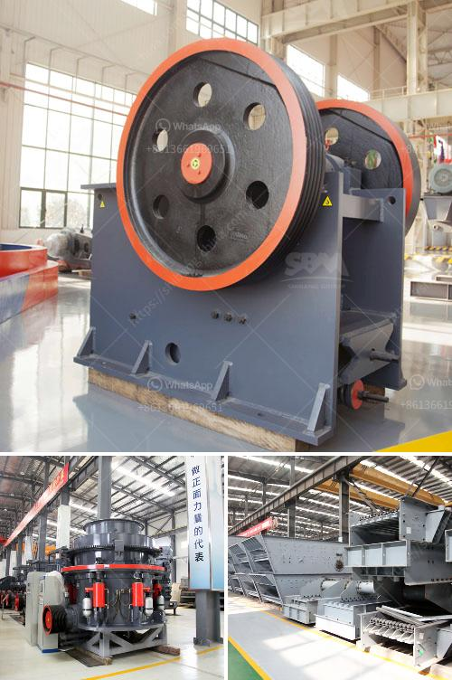

<h3>jaw crusher typex</h3>
Jaw crushers are one of the most commonly used heavy machinery in mining, construction, and other industries. They are designed to crush large rocks into smaller pieces, reducing them to manageable sizes for further processing or use. Among the wide range of jaw crusher types available, the Type X stands out for its versatility and durability.

The Type X jaw crusher is a versatile crushing machine that can be used for a variety of applications. It is ideal for materials with varying levels of hardness, from soft to extremely hard. Whether it is limestone, granite, basalt, or any other type of material, the Type X can handle it with ease.

One of the key features of the Type X jaw crusher is its adjustable jaw settings. This allows users to control the size of the desired end product and achieve precise crushing results. The adjustable settings make it suitable for a wide range of applications. Whether you need coarse crushing or fine crushing, the Type X can deliver.

Another advantage of the Type X jaw crusher is its robust construction. It is built to withstand heavy-duty operations and is designed for long-term use. The strong and durable components ensure that the crusher can handle tough materials and endure the rigors of continuous operation.

In addition, the Type X jaw crusher is easy to operate and maintain. It has a user-friendly interface, making it simple for operators to adjust settings and control the crusher's operation. Routine maintenance is also straightforward, ensuring minimal downtime and maximum productivity.

Overall, the Type X jaw crusher is a reliable and efficient crushing machine for various industries. Its versatility, durability, and ease of use make it an excellent choice for any crushing application. Whether you are in the mining, construction, or recycling industry, the Type X can help you achieve the desired crushing results. Trust in this powerful machine to process your materials efficiently and effectively.
<h3>Contact us</h3><ul><li><strong>Whatsapp:&nbsp;<a href="https://wa.me/8613661969651">+8613661969651</a></strong></li><li><a href="https://swt.shibang-china.com/?git&amp;zhl&amp;jaw crusher typex"><strong>Online Service(chat now)</strong></a></li></ul><h3>Related</h3><ul><li><a href='jaw crusher machine supplier.md'>jaw crusher machine supplier</a></li><li><a href='tertiary vertical shaft impact crusher.md'>tertiary vertical shaft impact crusher</a></li><li><a href='3 roller raymond mill.md'>3 roller raymond mill</a></li><li><a href='crushing complete crushing plant 150tph 200tph.md'>crushing complete crushing plant 150tph 200tph</a></li><li><a href='micronized quartz crusher plant.md'>micronized quartz crusher plant</a></li></ul>