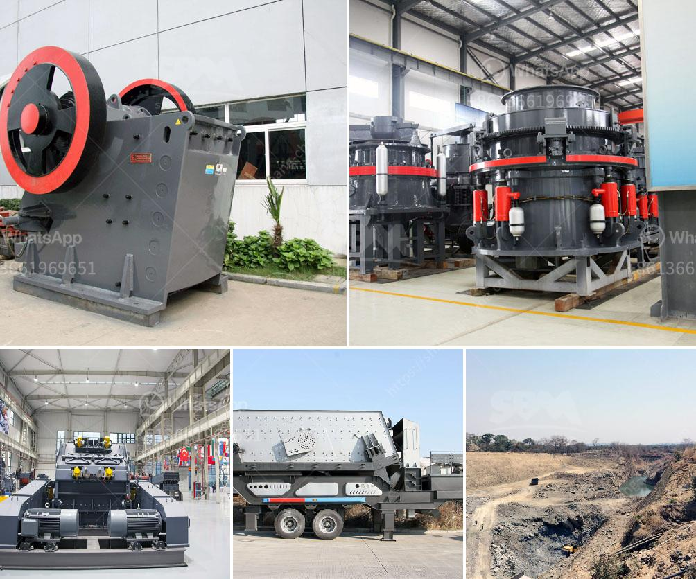

<h3>jaw crushing plants saudi</h3>
Saudi Arabia is rich in mineral resources in addition to the oil and gas resources, which have attracted the highest investment, with jaw crushing plants, they are widely used in the mining industry, which is a hot-selling product in Saudi Arabia.

Due to the rich reserves of oil resources, Saudi Arabia is becoming one of the fastest-growing economies in the Middle East. As a result, the mining industry has seen significant growth in recent years, bolstered by the increasing demand for minerals and other resources. In order to meet this rising demand, there is a need for highly efficient mining equipment that is capable of extracting minerals from the earth in a cost-effective and sustainable manner. This is where jaw crushing plants come into play.

Jaw crushing plants are machines used for primary crushing of hard rocks and mineral ores. These plants are usually deployed in quarries and mines where mineral deposits are concentrated. As the name suggests, jaw crushers reduce rock and other materials between a fixed and moving jaw. The moving jaw is mounted on a pitman that has a reciprocating motion, allowing it to crush rocks by constantly pushing them against the stationary jaw. This process is highly effective, and jaw crushers are known for their high capacity and low maintenance requirements.

The significance of jaw crushing plants in the mining industry cannot be underestimated. These plants are designed to extract mineral ores and rocks from the earth with ease. They are widely used in various sectors of the mining industry, including construction, metallurgy, and recycling. Jaw crushers have been used for decades in quarrying and mining operations, and they have gained a reputation for being extremely reliable and durable.

In Saudi Arabia, one of the most developed countries in the Middle East, the use of modern technology and machinery has become a crucial factor in the country's economic growth. With the increasing demand for minerals and the expanding mining activities, jaw crushing plants are widely used in the mining industry. These plants have proven to be a revolutionary addition to the mining sector, offering endless possibilities for efficient ore extraction.

The advantages of using jaw crushing plants in the mining industry are endless. Firstly, jaw crushers possess high capacity, allowing large amounts of ore to be processed efficiently. Secondly, they are designed with a robust and durable construction, ensuring long-lasting performance and low maintenance costs. Thirdly, jaw crushing plants can be easily transported and assembled, making them highly versatile and suitable for various mining applications.

In conclusion, jaw crushing plants have become a game changer in the mining industry in Saudi Arabia due to their ability to crush efficiently and reduce material size to facilitate further processing. This has led to an increased demand for jaw crushers in the country, as these machines offer excellent performance and durability, ensuring the success of mining projects. With the continuing growth of the mining industry in Saudi Arabia, jaw crushing plants have a bright future ahead.
<h3>Contact us</h3><ul><li><strong>Whatsapp:&nbsp;<a href="https://wa.me/8613661969651">+8613661969651</a></strong></li><li><a href="https://swt.shibang-china.com/?git&amp;zhl&amp;jaw crushing plants saudi"><strong>Online Service(chat now)</strong></a></li></ul><h3>Related</h3><ul><li><a href='limestone crusher china.md'>limestone crusher china</a></li><li><a href='quarry stone for sale in malta.md'>quarry stone for sale in malta</a></li><li><a href='portable stone crusher for sale india price.md'>portable stone crusher for sale india price</a></li><li><a href='rock crusher plants in germany.md'>rock crusher plants in germany</a></li><li><a href='mobile crusher for.md'>mobile crusher for</a></li></ul>