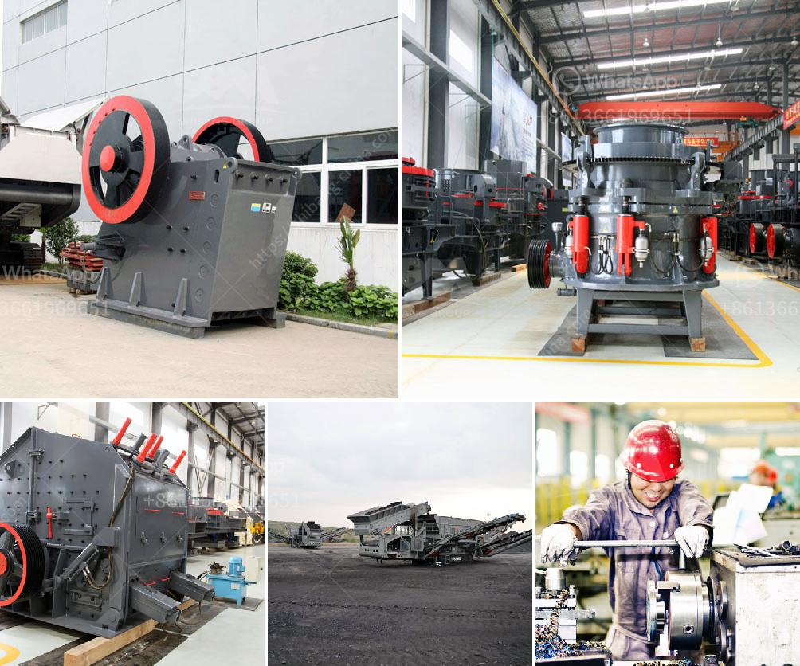

<h3>jaw rock crusher price by owner</h3>
When it comes to purchasing a jaw rock crusher, it is essential to consider the price. As an owner-occupier, you want to ensure that you are getting the best deal possible. There are several factors that can influence the price, including the size, capacity, brand, and condition of the crusher. By understanding these factors, you can make an informed decision and find the jaw rock crusher that meets your requirements.

The size of the jaw rock crusher is an important consideration. Generally, the larger the crusher, the more expensive it will be. This is because larger crushers are capable of handling bigger rocks and producing higher output. However, if you only need a small quantity of crushed rocks, opting for a smaller crusher may be more cost-effective.

Capacity is another factor that affects the price of a jaw rock crusher. The capacity refers to the maximum amount of material that the crusher can process per hour. Higher capacity crushers are typically more expensive as they are designed to handle larger volumes of rocks. However, if you require a lower capacity, there are cheaper options available that can still meet your needs.

Brand reputation also plays a role in the pricing of jaw rock crushers. Well-known and established brands tend to be more expensive due to their reputation for quality and reliability. While these crushers may be more expensive upfront, they often prove to be a worthwhile investment in the long run. On the other hand, lesser-known brands may offer more affordable options, but their quality and durability may be questionable.

The condition of the jaw rock crusher is another factor to consider. Used crushers are often available at a lower price compared to new ones. However, it is important to thoroughly inspect the used crusher before making a purchase. Look for any signs of wear and tear, damage, or structural issues that could affect its performance. It might be worth spending a little more on a new crusher if the used one requires extensive repairs or maintenance.

It is always advisable to do some research and compare prices from different sellers. As an owner, you can explore various platforms and websites specializing in selling jaw rock crushers. Take note of the prices offered by different sellers and compare their offerings in terms of size, capacity, brand, and condition. This will help you find the best deal that meets your requirements while staying within your budget.

In conclusion, the price of a jaw rock crusher by an owner can vary depending on various factors such as size, capacity, brand, and condition. It is important to carefully assess your needs and budget before making a decision. By researching and comparing prices from different sellers, you can find a jaw rock crusher that offers the best value for your money. Remember to also prioritize the quality and reliability of the crusher to ensure a worthwhile investment.
<h3>Contact us</h3><ul><li><strong>Whatsapp:&nbsp;<a href="https://wa.me/8613661969651">+8613661969651</a></strong></li><li><a href="https://swt.shibang-china.com/?git&amp;zhl&amp;jaw rock crusher price by owner"><strong>Online Service(chat now)</strong></a></li></ul><h3>Related</h3><ul><li><a href='rock crushing machine suppliers.md'>rock crushing machine suppliers</a></li><li><a href='mill grinding machine in egypt.md'>mill grinding machine in egypt</a></li><li><a href='modeling clay process plant.md'>modeling clay process plant</a></li><li><a href='granite stone quarrying equipment.md'>granite stone quarrying equipment</a></li><li><a href='crusher philippines.md'>crusher philippines</a></li></ul>