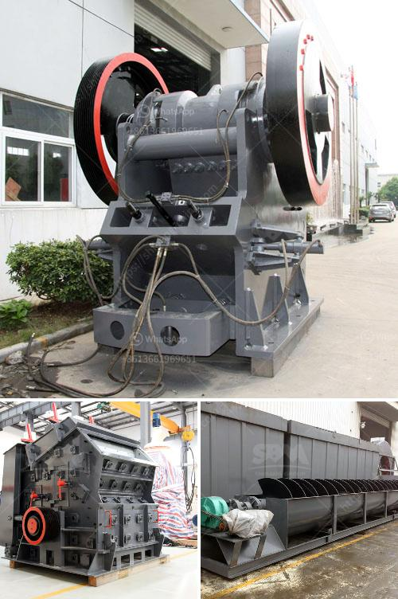

<h3>jual jaw crusher 400 x</h3>
Jaw Crusher is a primary crushing machine used in the crushing plant. The wearing parts of jaw crusher are mainly the movable jaw plate, fixed jaw plate, cheek plate and toggle plate. Sinco Jaw plate is manufactured with High Manganese steel of Mn13Cr2, Mn14Cr2, Mn18Cr2, Mn22, ASTM A128 Gr A & B2 & B3, BS 3100 Gr BW10, SABS 407 Type 1 & 2 or other customized material.

Through special heat-treatment process and With special chemical composition, Sinco jaw plate has a service life 30% longer than those of traditional high manganese steel. Jaw Crusher models: 10-36(Jaw Crusher), 15-50(Jaw Crusher), 20-36(Jaw Crusher), 24-36(Jaw Crusher), 26-44(Jaw Crusher), 30-42(Jaw Crusher), Jaw Crusher Plant.

Jaw Crusher is mainly used to crush kinds of mining stones primarily, and the largest compression resistance of the material to be crushed is 320 MPa. The jaw crusher is widely used in mining, metall-urgical industry, building material, highway, railway, and chemical industry.

Jual Jaw Crusher 400 x 600 can achieve the crushing ratio of 4-6 and the shape of final product is even. It is widely applied to crush high hardness, mid hardness and soft rocks and ores such as slag, construction materials, marble, etc. The pressure resistance strength is under 200Mpa, that is, suitable for primary crush. Jaw crusher can be used in mining, metallurgical industry, construction, road and railway building, conversancy, chemistry, etc.

There are some factors to be considered while purchasing Jual Jaw Crusher 400 x 600: jaw crusher size, material feeding size, required final product size, capacity, working environment, and most importantly the budget. Many different kinds of crusher, some suitable for coarse crushing, some is broken, apply to some suitable for fine grinding, so the feed inlet size is different.

The function of jaw crusher is the same as the crushing equipment of other mines. In addition, the infrastructure construction of various regions is constantly improving, and the demand for jaw crushers is also increasing. The crushing ratio of jaw crusher is very large, and can be used in the crushing of many different ores. It is commonly used in mining, smelting, building materials, highways, railways, water conservancy and chemical industries.

The jaw crusher has a simple structure, reliable operation, and low operating costs. 6 models of jaw crushers can meet a variety of crushing requirements.

In conclusion, Jual Jaw Crusher 400 x 600 has a large crushing ratio, high output, uniform particle size, simple structure, reliable operation, easy maintenance, and economical operation. It is currently the most widely used crushing equipment.
<h3>Contact us</h3><ul><li><strong>Whatsapp:&nbsp;<a href="https://wa.me/8613661969651">+8613661969651</a></strong></li><li><a href="https://swt.shibang-china.com/?git&amp;zhl&amp;jual jaw crusher 400 x"><strong>Online Service(chat now)</strong></a></li></ul><h3>Related</h3><ul><li><a href='malaysia stone crushing machine crusher for sale.md'>malaysia stone crushing machine crusher for sale</a></li><li><a href='ball mill crusher efficiency.md'>ball mill crusher efficiency</a></li><li><a href='gravel and sand supply business plan pdf.md'>gravel and sand supply business plan pdf</a></li><li><a href='stone crusher 60 to 100 tonnes per hour.md'>stone crusher 60 to 100 tonnes per hour</a></li><li><a href='crushing and screening of manganese ore.md'>crushing and screening of manganese ore</a></li></ul>