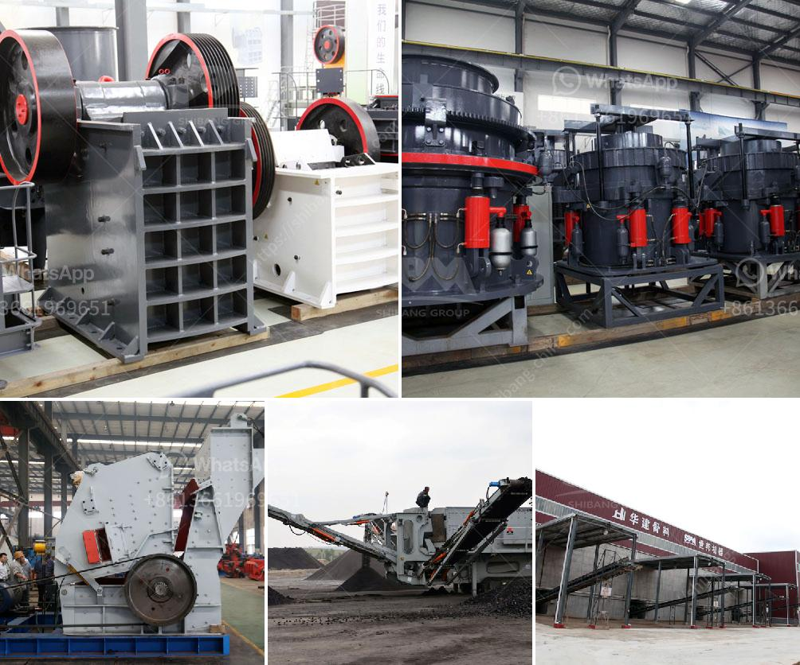

<h3>jual mesin hammer mill crusher for sale</h3>
Machines are made to ease our daily lives and to minimize human effort. The industrial revolution has introduced various machines, and they have become an essential part of industries around the world. One such machine that has proven to be highly beneficial is the mesin hammer mill crusher.

The mesin hammer mill crusher is a machine used to crush various types of materials into small pieces. The machine is commonly used for grinding corn, spices, herbs, and other substances. Users can also use it to crush wood, branches, and any other biomass materials that require size reduction.

With the rise in demand for efficient machines for industries, the market for mesin hammer mill crushers is expanding rapidly. That is why there are various options available for purchasing a mesin hammer mill crusher. One of the reliable sources to find high-quality machines is through jual mesin hammer mill crusher for sale.

Jual mesin hammer mill crusher for sale offers customers the opportunity to own a high-performance machine at an affordable price. These machines are durable and easy to maintain, making them a long-term investment for industries. In addition to their robust construction, mesin hammer mill crushers offer numerous advantages.

Firstly, the machines are versatile and can handle a wide range of materials. Whether it is grains, wood, or biomass, these crushers can efficiently reduce the size of the material. The adjustable settings of the machine allow users to control the output size, making it suitable for various applications.

Secondly, mesin hammer mill crushers are designed to be user-friendly. They come with intuitive controls and simple operation procedures. This ensures that even those with minimal technical skills can operate the machine without any hassle. Additionally, the machines are equipped with safety features to prevent any accidents during operation.

One of the major reasons why industries opt for jual mesin hammer mill crusher for sale is its high efficiency. These machines are designed to have a high throughput rate, allowing for quick and efficient processing. They are capable of producing a large quantity of finely crushed material in a short span of time.

Furthermore, mesin hammer mill crushers are cost-effective. They consume less power compared to other types of crushers, resulting in reduced electricity bills. Additionally, the low maintenance requirements of these machines help in saving operational costs in the long run.

When considering purchasing a mesin hammer mill crusher, it is essential to conduct thorough research. It is crucial to find a reputable seller who offers high-quality machines that meet industry standards. Jual mesin hammer mill crusher for sale provides customers with the assurance of purchasing a reliable and efficient crusher.

In conclusion, the mesin hammer mill crusher is a valuable machine that offers numerous benefits to industries. Jual mesin hammer mill crusher for sale provides an excellent opportunity for businesses to acquire a top-quality machine at a reasonable price. With their versatility, ease of use, and cost-effectiveness, these crushers are a valuable asset for industries looking for efficient material size reduction solutions.
<h3>Contact us</h3><ul><li><strong>Whatsapp:&nbsp;<a href="https://wa.me/8613661969651">+8613661969651</a></strong></li><li><a href="https://swt.shibang-china.com/?git&amp;zhl&amp;jual mesin hammer mill crusher for sale"><strong>Online Service(chat now)</strong></a></li></ul><h3>Related</h3><ul><li><a href='aggregate crusher plant.md'>aggregate crusher plant</a></li><li><a href='service de carbonate de calcium de broyage.md'>service de carbonate de calcium de broyage</a></li><li><a href='conveyor belts for aggregates.md'>conveyor belts for aggregates</a></li><li><a href='difference between jaw crusher and cone crusher.md'>difference between jaw crusher and cone crusher</a></li><li><a href='stone crushers in belen.md'>stone crushers in belen</a></li></ul>