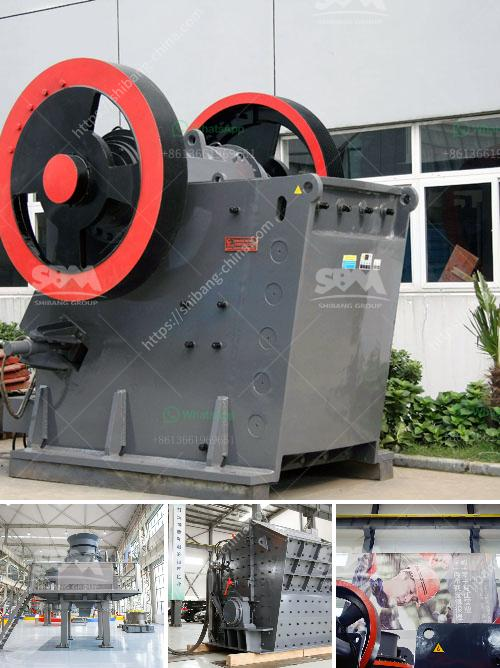

<h3>jual stone crusher portable</h3>
Stone crushing is an important process in various industries, such as mining, construction, metallurgy, chemistry, and others. For the production of high-quality aggregates, the need for efficient and portable stone crushing plants is increasing. Therefore, individuals and businesses are opting for portable stone crushers to meet their crushing needs. One such portable stone crusher that is commonly used is the jual stone crusher portable.

A jual stone crusher portable is a compact and portable rock crusher machine manufactured by using advanced machinery and equipment. It is a fully mobile rock crushing plant equipped with a jaw crusher, vibrating feeder, vibrating screen, belt conveyor, and so on. It is a modern and simple stone crusher with advanced technical level.

The jual stone crusher portable is usually mounted on tires and equipped with a light trailer frame. The compact structure of the portable stone crusher greatly reduces the size of transportation and makes it easy to install and operate. It also offers high flexibility and convenience as it can be quickly moved from one location to another.

The jual stone crusher portable can handle a variety of materials, such as limestone, granite, basalt, river pebble, and construction waste. It can meet different material processing requirements, making it ideal for various applications. Whether it is for small-scale mining operations or crushing projects in remote areas, the jual stone crusher portable can deliver excellent performance.

One of the key features of the jual stone crusher portable is its high crushing efficiency. It uses a crushing chamber with a V-shaped structure, which ensures uniform feeding and improves the crushing efficiency. The deep cavity design of the jaw crusher allows the stones to be fully broken and reduces the blocking phenomenon. Additionally, the jual stone crusher portable is equipped with a powerful motor, which provides strong driving force and ensures high productivity.

Another advantage of the jual stone crusher portable is its environmental friendliness. It is equipped with a dust suppression system, which effectively controls dust during the crushing process, reducing environmental pollution. The low noise operation of the machine also contributes to a more comfortable and healthier working environment.

In conclusion, the jual stone crusher portable is an efficient and reliable equipment for crushing stones. It offers high flexibility, ease of transportation, and superior crushing performance. With its compact structure and powerful motor, it can handle various materials and is suitable for different applications. Moreover, its environmental friendliness makes it a preferred choice for many individuals and businesses. If you are in need of a portable stone crusher, consider the jual stone crusher portable for your crushing needs.
<h3>Contact us</h3><ul><li><strong>Whatsapp:&nbsp;<a href="https://wa.me/8613661969651">+8613661969651</a></strong></li><li><a href="https://swt.shibang-china.com/?git&amp;zhl&amp;jual stone crusher portable"><strong>Online Service(chat now)</strong></a></li></ul><h3>Related</h3><ul><li><a href='small stone crushing machine.md'>small stone crushing machine</a></li><li><a href='kaolin grindig companies in nigeria.md'>kaolin grindig companies in nigeria</a></li><li><a href='gravel making equipment.md'>gravel making equipment</a></li><li><a href='marble grinder mill machine price in pakistan.md'>marble grinder mill machine price in pakistan</a></li><li><a href='basalt quarry equipments.md'>basalt quarry equipments</a></li></ul>