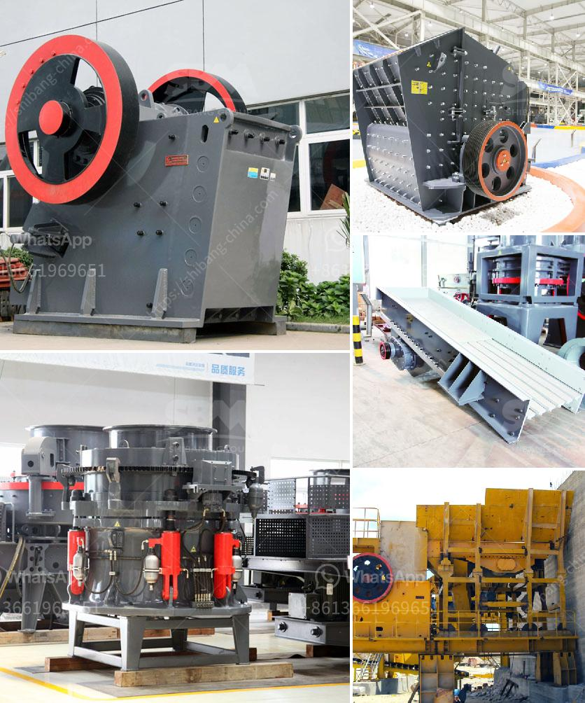

<h3>kaolin clay mining process</h3>
Kaolin clay, also known as China clay, is a white, soft, and versatile mineral that has a wide range of uses. It is commonly used in the manufacture of porcelain, pottery, paper, rubber, and cosmetics. Kaolin clay is mined from deposits of weathered rocks that are rich in kaolinite, a form of aluminum silicate.

The mining process for kaolin clay is similar to that of most minerals. Firstly, the raw ore must be mined from the ground and then it has to be beneficiated to remove impurities before it can be utilized in various industries. The beneficiation process consists of three main steps:

1. Extraction: In the primary extraction stage, the raw ore is mined from the ground using different techniques such as open-pit mining, underground mining, or borehole mining. Once the ore is extracted, it is transported to the processing plant where it is crushed and broken into smaller pieces.

2. Classification: The crushed kaolin clay is then classified into various sizes using vibrating screens. The different sizes of kaolin clay are required for different applications, so this step ensures that the clay is sorted into the relevant categories.

3. Slurry Formation: After classification, the kaolin clay is mixed with water to form a slurry. The slurry is then pumped into large settling tanks where the heavy impurities settle down due to gravity. This process is known as sedimentation. The clear water on top is decanted and recycled for further use.

4. Filtration: The slurry is then passed through filters to remove any remaining impurities. This step helps in achieving a higher purity level for the final clay product.

5. Drying: The filtered clay is then dried using either flash dryers or rotary dryers to remove any remaining moisture. The drying process lowers the water content to a specific desired level and improves the handling and storage properties of the clay.

6. Calcination: In some cases, kaolin clay may undergo additional processing known as calcination. During calcination, the kaolin is heated at high temperatures, typically above 600°C, to remove any remaining water molecules and alter the crystal structure of the mineral. This process enhances the brightness and opacity of the clay, making it more suitable for certain applications such as paper production.

7. Packaging: Once the kaolin clay has gone through the necessary steps of extraction, beneficiation, drying, and calcination, it is ready to be packaged and transported to end-users. The clay is typically packed in bags or bulk containers, depending on the specific requirements of the customers.

It is worth noting that the mining and processing of kaolin clay must be performed carefully to minimize environmental impact. Companies are required to adhere to strict regulations to ensure responsible and sustainable mining practices. These regulations include measures to protect nearby ecosystems, reclaim mined land, and monitor air and water quality.

In conclusion, the mining process of kaolin clay involves extraction, classification, slurry formation, filtration, drying, and sometimes calcination. The kaolin clay is then packaged and transported to various industries for use in manufacturing a wide range of products. With the proper mining practices, kaolin clay can be obtained sustainably and used in an environmentally responsible manner.
<h3>Contact us</h3><ul><li><strong>Whatsapp:&nbsp;<a href="https://wa.me/8613661969651">+8613661969651</a></strong></li><li><a href="https://swt.shibang-china.com/?git&amp;zhl&amp;kaolin clay mining process"><strong>Online Service(chat now)</strong></a></li></ul><h3>Related</h3><ul><li><a href='jaw crusher specification for activated carbon.md'>jaw crusher specification for activated carbon</a></li><li><a href='gravel manufacturing company in thiruvallur district.md'>gravel manufacturing company in thiruvallur district</a></li><li><a href='how is calcite used to manufacture paper.md'>how is calcite used to manufacture paper</a></li><li><a href='crushing equipment aggregates crushing.md'>crushing equipment aggregates crushing</a></li><li><a href='service de carbonate de calcium de broyage.md'>service de carbonate de calcium de broyage</a></li></ul>