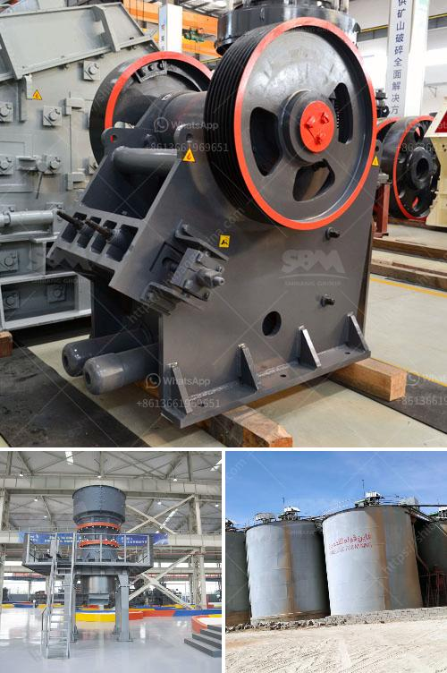

<h3>kaolin grindig companies in nigeria</h3>
Kaolin is a mineral found in abundance in Nigeria. It is one of the most sought after minerals by construction companies and other industrial applications. The availability of kaolin in Nigeria has led to a growth in the establishment of kaolin grinding companies in the country.

Kaolin is used as a filler in many industries such as rubber, plastics, and paints. It is also used in the paper industry as a coating material and as a component in ceramics and porcelain. The demand for kaolin in Nigeria has been on the rise due to the expansion of construction activities and the need for high-quality raw materials in various industries.

There are several kaolin grinding companies in Nigeria that are involved in the processing of this mineral. These companies have various grinding mills that are used to produce high-quality kaolin powders suitable for different applications. The grinding process involves the crushing, drying, and milling of kaolin to obtain powders with specific particle sizes.

One of the leading kaolin grinding companies in Nigeria is Global Kaolin Industries Limited. They have a state-of-the-art grinding mill that produces high-quality kaolin powders for various industries. The company focuses on providing customized solutions to their clients based on their specific requirements.

Another prominent kaolin grinding company in Nigeria is Kaolin and Ball Clay Association. They have been in operation for several years and have gained a reputation for their high-quality products. They have a team of skilled professionals who ensure that the grinding process is carried out efficiently and effectively.

In conclusion, the presence of kaolin grinding companies in Nigeria has contributed to the growth of various industries in the country. These companies provide high-quality kaolin powders suitable for different applications. With the increasing demand for kaolin, it is important for these companies to continue investing in modern grinding technologies to meet the growing needs of their clients.
<h3>Contact us</h3><ul><li><strong>Whatsapp:&nbsp;<a href="https://wa.me/8613661969651">+8613661969651</a></strong></li><li><a href="https://swt.shibang-china.com/?git&amp;zhl&amp;kaolin grindig companies in nigeria"><strong>Online Service(chat now)</strong></a></li></ul><h3>Related</h3><ul><li><a href='quartz grinding ball mill working.md'>quartz grinding ball mill working</a></li><li><a href='gyratory gyratory crusher manufacturer in india.md'>gyratory gyratory crusher manufacturer in india</a></li><li><a href='raymond mill micro pulverizer.md'>raymond mill micro pulverizer</a></li><li><a href='granite stone quarrying equipment.md'>granite stone quarrying equipment</a></li><li><a href='american stone crusher price.md'>american stone crusher price</a></li></ul>