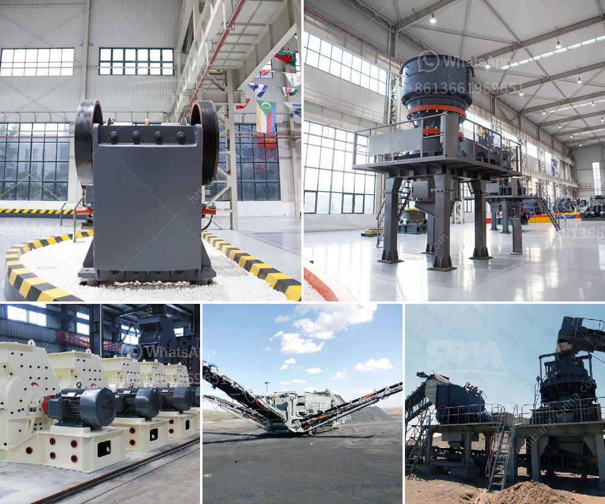

<h3>kaolin mill machine 400 mesh</h3>
Kaolin is a natural clay mineral that is used in various industries for its unique properties. One of the most common uses of kaolin is as a filler and coating material in the paper industry. It is also used in the production of ceramics, paints, rubber, and plastics. To achieve the desired particle size and fineness, kaolin needs to be processed by the kaolin mill machine.

The kaolin mill machine is specifically designed to process kaolin into fine powder to meet the 400 mesh fineness. It is often used as a grinding machine in the paper industry to produce high-quality paper and fillers. The kaolin mill machine consists of a main unit, a classifier, a blower, a cyclone collector, and other associated devices.

The raw kaolin materials are crushed and ground by the jaw crusher and hammer crusher into small particles. Then, through the elevator, they are sent to the storage bin and evenly fed into the main unit for grinding. The grinding rollers and grinding rings inside the mill machine rotate at different speeds, generating centrifugal force to grind the kaolin into fine powder.

The classifier inside the kaolin mill machine controls the particle size distribution and eliminates oversize particles. The fine powder is then sent to the cyclone collector for collection and storage. The blower operates at a high speed to blow the kaolin powder into the cyclone collector, while the air flow is filtered and discharged through the dust collector.

With the capability to mill the kaolin into 400 mesh fineness, the kaolin mill machine ensures that the particles are uniform and have a consistent size. This is essential for producing high-quality paper that requires smoothness and printability. The 400 mesh kaolin powder is also widely used in other industries, such as ceramics, paints, rubber, and plastics.

In conclusion, the kaolin mill machine plays a crucial role in processing kaolin into fine powder. With its advanced technology and efficient performance, it meets the 400 mesh fineness requirement for various applications. Whether it is used in the paper industry or other industries, the kaolin mill machine provides a reliable and efficient solution for grinding and processing kaolin.
<h3>Contact us</h3><ul><li><strong>Whatsapp:&nbsp;<a href="https://wa.me/8613661969651">+8613661969651</a></strong></li><li><a href="https://swt.shibang-china.com/?git&amp;zhl&amp;kaolin mill machine 400 mesh"><strong>Online Service(chat now)</strong></a></li></ul><h3>Related</h3><ul><li><a href='price of gypsum plant machines.md'>price of gypsum plant machines</a></li><li><a href='how is calcite used to manufacture paper.md'>how is calcite used to manufacture paper</a></li><li><a href='sample of joint operations agreement quarry mining.md'>sample of joint operations agreement quarry mining</a></li><li><a href='list of the price of crushing plant turkey.md'>list of the price of crushing plant turkey</a></li><li><a href='list of used machines coal mining.md'>list of used machines coal mining</a></li></ul>