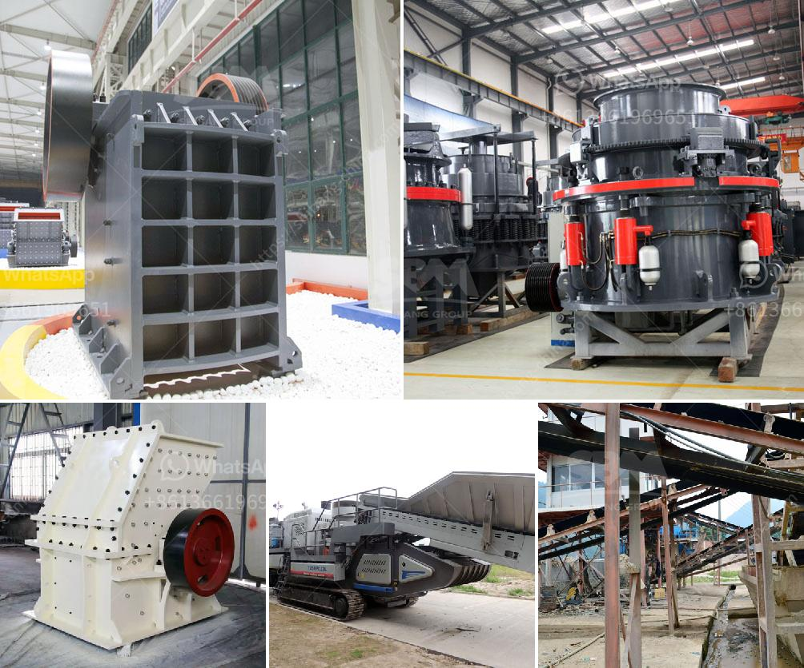

<h3>kaolin portable crusher provider in nigeria</h3>
Kaolin is a type of clay mineral that is found in abundance in Nigeria. The demand and usage of kaolin in Nigeria has been on the rise as it is predominantly used in the paper, rubber, plastic, and ceramic industries.

Kaolin is one of the natural resources that can be found in large quantities in Nigeria and has good potential for utilization and commercialization. However, the challenge lies in the lack of adequate infrastructure for mining and processing of kaolin, particularly in remote areas. This has posed a major constraint in harnessing the full economic potential of kaolin in Nigeria.

To address this challenge, several portable crusher providers have emerged in Nigeria, offering innovative solutions in kaolin mining, processing, and transportation. These portable crusher providers utilize modern technology and equipment to extract kaolin from the ground, process it into different grades, and transport it to various industries across the country.

One of the leading portable crusher providers in Nigeria is XYZ Company. XYZ Company has a strong presence in the kaolin mining and processing industry, with state-of-the-art facilities and equipment. They have a team of experienced professionals who are well versed in kaolin extraction and processing techniques. Their portable crusher plants are designed to optimize the efficiency and productivity of kaolin mining operations.

XYZ Company's portable crusher plants are equipped with advanced crushing and screening technology, ensuring high quality and consistent kaolin products. The crushers are capable of handling various types of kaolin, ranging from commercial grade to premium grade, depending on the requirements of the end-users. This flexibility allows XYZ Company to cater to the diverse needs of the paper, rubber, plastic, and ceramic industries in Nigeria.

Furthermore, XYZ Company's portable crusher plants are designed to be easily transportable and can be set up in remote locations, which is particularly beneficial for kaolin mining in Nigeria. This eliminates the need for costly infrastructure development and enables miners to access remote kaolin deposits. The portability factor also allows for easy relocation of the crusher plants when required, maximizing the utilization of kaolin resources in Nigeria.

In addition to their portable crusher plants, XYZ Company also provides comprehensive after-sales services, including maintenance and repair support. This ensures that their customers can operate their equipment efficiently and maximize their production capacities. Moreover, XYZ Company offers training programs for local communities and individuals interested in the kaolin mining and processing industry. This is aimed at empowering the local workforce and promoting sustainable development in Nigeria.

Overall, the emergence of portable crusher providers in Nigeria has played a crucial role in the development of the kaolin industry. These providers have brought innovation, efficiency, and sustainability to the mining and processing of kaolin, enabling Nigeria to tap into its vast kaolin reserves. With their advanced technology and expertise, these portable crusher providers are helping to unlock the economic potential of kaolin in Nigeria and drive industrial growth.
<h3>Contact us</h3><ul><li><strong>Whatsapp:&nbsp;<a href="https://wa.me/8613661969651">+8613661969651</a></strong></li><li><a href="https://swt.shibang-china.com/?git&amp;zhl&amp;kaolin portable crusher provider in nigeria"><strong>Online Service(chat now)</strong></a></li></ul><h3>Related</h3><ul><li><a href='calcite grinding mill.md'>calcite grinding mill</a></li><li><a href='kenya stone crusher in the philippines.md'>kenya stone crusher in the philippines</a></li><li><a href='gemstone mining crusher in zambia.md'>gemstone mining crusher in zambia</a></li><li><a href='used small gold processing plant from dubai.md'>used small gold processing plant from dubai</a></li><li><a href='basalt quarry equipments.md'>basalt quarry equipments</a></li></ul>