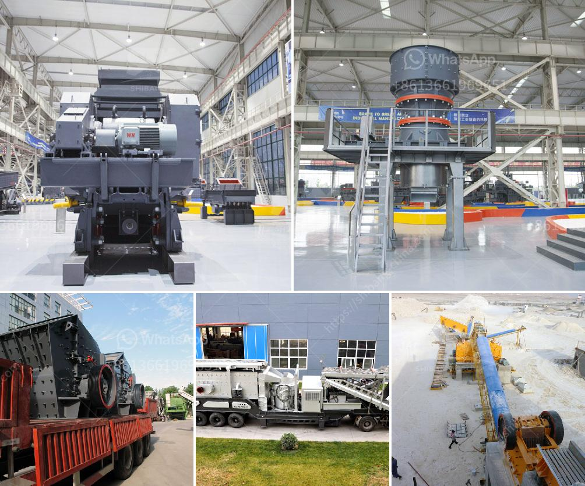

<h3>kaolin process flow diagram</h3>
Kaolin, also known as China clay, is a white, soft, and plastic clay mineral that is mainly composed of kaolinite mineral. Kaolin is widely used in various industries, including paper, ceramics, rubber, paints, plastics, agriculture, and pharmaceuticals. To meet the growing demands of these industries, the kaolin mining and processing industry has developed various techniques for extracting and refining kaolin from the ground.

The process flow diagram of kaolin extraction involves various steps, which have been outlined below:

1. Mining: Kaolin deposits are usually located close to the surface and are open-pit mined. The initial step in the extraction process is to remove the overburden, which is the soil and rock covering the deposit. This is usually done with the help of large earthmovers and bulldozers.

2. Blunging: After the overburden is removed, the raw kaolin is excavated and transported to a blunger, which is a large mechanical device that mixes the kaolin with water. The blunger breaks down the kaolin particles into a slurry of fine particles, thus separating it from impurities.

3. Screening: The kaolin slurry is then passed through a series of screens to remove any larger impurities or debris. This step ensures that a refined kaolin product is obtained, free from any unwanted materials.

4. Classification: Next, the slurry undergoes a process known as classification, where it is separated into various particle sizes. This is usually done using hydrocyclones or centrifuges. The different particle sizes obtained are used for different applications, such as paper coating or ceramics.

5. Magnetic separation: In some cases, magnetic separation is employed to remove any iron or titanium impurities that may be present in the kaolin. This step is crucial for applications that require a high degree of purity.

6. Dehydration: The refined kaolin slurry is then sent to a series of filters or centrifuges to remove excess water. This process is crucial to achieve the desired moisture content in the final kaolin product.

7. Drying: Finally, the kaolin is dried in large ovens or rotary dryers to reduce moisture levels to a suitable range. The drying process also helps to improve the physical properties and stability of the kaolin.

8. Packaging and transport: The dried kaolin is then packaged in bags or bulk containers and prepared for transport. Kaolin is usually transported via trucks, rail, or ships, depending on the distance and infrastructure available.

The process flow diagram outlined above is a generic one, and specific variations may exist depending on the deposit characteristics and the desired end product. Nonetheless, the main steps involved in the extraction and refining of kaolin remain consistent.

Kaolin, with its wide range of applications and extensive use in various industries, plays a vital role in our daily lives. From the paper we write on to the ceramics we use, kaolin is an essential ingredient. The efficient and sustainable extraction and refining process ensures that kaolin can continue to meet the demands of the ever-growing industries.
<h3>Contact us</h3><ul><li><strong>Whatsapp:&nbsp;<a href="https://wa.me/8613661969651">+8613661969651</a></strong></li><li><a href="https://swt.shibang-china.com/?git&amp;zhl&amp;kaolin process flow diagram"><strong>Online Service(chat now)</strong></a></li></ul><h3>Related</h3><ul><li><a href='crusher for bed ash manufacturers.md'>crusher for bed ash manufacturers</a></li><li><a href='prices for sand washer on sale in india.md'>prices for sand washer on sale in india</a></li><li><a href='coal mill in malaysia.md'>coal mill in malaysia</a></li><li><a href='conveyor belts in coal transport sizing.md'>conveyor belts in coal transport sizing</a></li><li><a href='mobile jaw crushers for sale in italy.md'>mobile jaw crushers for sale in italy</a></li></ul>