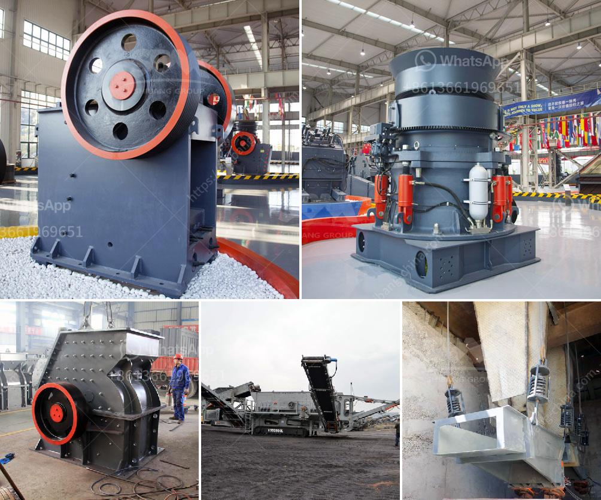

<h3>kenya roller mill</h3>
In the world of grain milling, efficiency and precision are key factors for success. The advent of roller mills has revolutionized the industry, effectively increasing productivity while reducing costs. One of the leading countries in embracing this technological innovation is Kenya, where roller mills have become widespread, transforming the face of grain processing.

A roller mill is a specialized piece of machinery used to grind various types of grains such as wheat, maize, and sorghum into flour. Unlike traditional stone mills, roller mills operate by crushing grains between cylindrical rollers. This process results in a finer and more consistent product, which is highly sought after in the food industry.

Kenya, known for its agricultural abundance, has a rich history of grain processing. Traditionally, stone mills were used to grind grains, but these were labor-intensive and had limitations in terms of efficiency and quality. The introduction of roller mills eliminated these shortcomings and opened up new opportunities for farmers, millers, and consumers alike.

One of the key advantages of roller mills is their ability to process a larger volume of grains in a shorter period of time. This means that millers can produce more flour and meet the growing demand without expanding their facilities. Additionally, roller mills offer greater control over the grinding process, allowing millers to adjust the settings and achieve the desired fineness of flour.

In Kenya, roller mills have also contributed to reducing post-harvest losses. Traditionally, grains were stored in bulk, leaving them vulnerable to pest infestations and spoilage. With roller mills, farmers can process their grains immediately after harvest, reducing the risk of spoilage and ensuring a higher quality final product.

Furthermore, roller mills have empowered small-scale farmers by providing them with an additional source of income. Rather than selling their grains immediately after harvest at low prices, farmers can now process and sell flour directly to consumers or local markets, fetching a higher price for their products. This not only improves their livelihoods but also helps to stimulate economic growth within rural communities.

The adoption of roller mills in Kenya has not been without challenges. The initial cost of acquiring the machinery can be prohibitive for small-scale millers. However, various organizations and government initiatives have been introduced to address this issue, providing financial assistance and training to millers to help them embrace this technology.

In conclusion, the roller mill has transformed the milling industry in Kenya, providing a more efficient and reliable method of grain processing. Its ability to increase productivity, reduce post-harvest losses, and empower farmers has made roller mills a popular choice among millers. With continued support and investment, roller mills have the potential to revolutionize not only the grain milling industry but also the overall agricultural landscape in Kenya.
<h3>Contact us</h3><ul><li><strong>Whatsapp:&nbsp;<a href="https://wa.me/8613661969651">+8613661969651</a></strong></li><li><a href="https://swt.shibang-china.com/?git&amp;zhl&amp;kenya roller mill"><strong>Online Service(chat now)</strong></a></li></ul><h3>Related</h3><ul><li><a href='stone crusher machine price for plant.md'>stone crusher machine price for plant</a></li><li><a href='coal mining processes and machinary required.md'>coal mining processes and machinary required</a></li><li><a href='denver ball mills.md'>denver ball mills</a></li><li><a href='stone crusher used machinery for sale in india.md'>stone crusher used machinery for sale in india</a></li><li><a href='granite feeding equipment manufacturer.md'>granite feeding equipment manufacturer</a></li></ul>