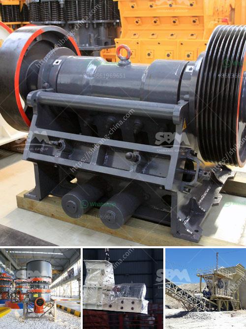

<h3>kenya stone crusher in the philippines</h3>
Kenya is known for its natural beauty and diverse wildlife, but aside from its enchanting landscapes, it’s also rich in minerals that have made it economically stable and supported its growth over the years. One of the minerals that can be found in the country is stone. With its abundance and versatility, stones have various applications in construction, landscaping, and other industries. In Kenya, stone mining is one of the booming industries in the region, offering a chance for entrepreneurs and investors to take advantage of its growing demand.

The Philippines, on the other hand, is a Southeast Asian country located in the western Pacific Ocean. It is known for its beautiful beaches, captivating landscapes, and vibrant culture. Like Kenya, it also has a thriving construction industry and a growing demand for stones to support infrastructure development, housing projects, and other construction-related activities.

With both Kenya and the Philippines' shared interest in the stone industry, it comes as no surprise that there are opportunities for collaboration and investment between the two countries. Kenya stone crusher in the Philippines can be used as building materials for various construction activities such as road construction, concrete projects, and other infrastructure projects.

Kenya stone crusher in the Philippines has a wide range of applications and can process materials such as limestone, granite, basalt, iron ore, river pebbles, construction waste, etc. Medium and large-sized stones are the preferred materials for stone crushers because they have a higher output, more durable and more efficient, and the crushing rate is also greater.

The length of the Kenya stone crusher in the Philippines is varied according to the production requirements of users. Its main functions are the crushing of the brittle material and the intermediate material, and the discharging of the finished material. Since it has been improved and perfected in the development process, it has more superior performance and is more suitable for processing materials between 150-930mm.

Among the different types of stone crushers, the cone crusher is the perfect choice for Kenya stone crusher in the Philippines. It has excellent features and can meet the demand of various users for production and processing. The cone crusher in the Philippines has a long service life, using the operating principle of stone hits stone, so that the material will be broken along the natural texture and cleavage surface in the crushing chamber, thereby producing granular products with uniform particle size, simple structure, reliable work, low operating costs, energy-saving characteristics.

In conclusion, Kenya stone crushers in the Philippines have proven to be reliable and efficient devices. In recent years, Kenya has developed mining industry as a buyer and importer of crushers in the Philippine market due to the abundant mineral resources that attract many stone crushers manufacturers, while also attracting increased attention to the crushing equipment industry. With the rapid economic development in the Philippines, many infrastructure projects such as highways, bridges, dams, and urban renewal are increasingly in demand, creating a strong potential market for stone crushers from Kenya. This presents an excellent opportunity for Kenyan entrepreneurs to invest in the Philippine stone crusher industry, and expand their business horizons.
<h3>Contact us</h3><ul><li><strong>Whatsapp:&nbsp;<a href="https://wa.me/8613661969651">+8613661969651</a></strong></li><li><a href="https://swt.shibang-china.com/?git&amp;zhl&amp;kenya stone crusher in the philippines"><strong>Online Service(chat now)</strong></a></li></ul><h3>Related</h3><ul><li><a href='crusher peru price.md'>crusher peru price</a></li><li><a href='price of stone crusher from china.md'>price of stone crusher from china</a></li><li><a href='jaw crusher in germany used.md'>jaw crusher in germany used</a></li><li><a href='mobile screen and crushing.md'>mobile screen and crushing</a></li><li><a href='sale of running stone crusher in philippines.md'>sale of running stone crusher in philippines</a></li></ul>