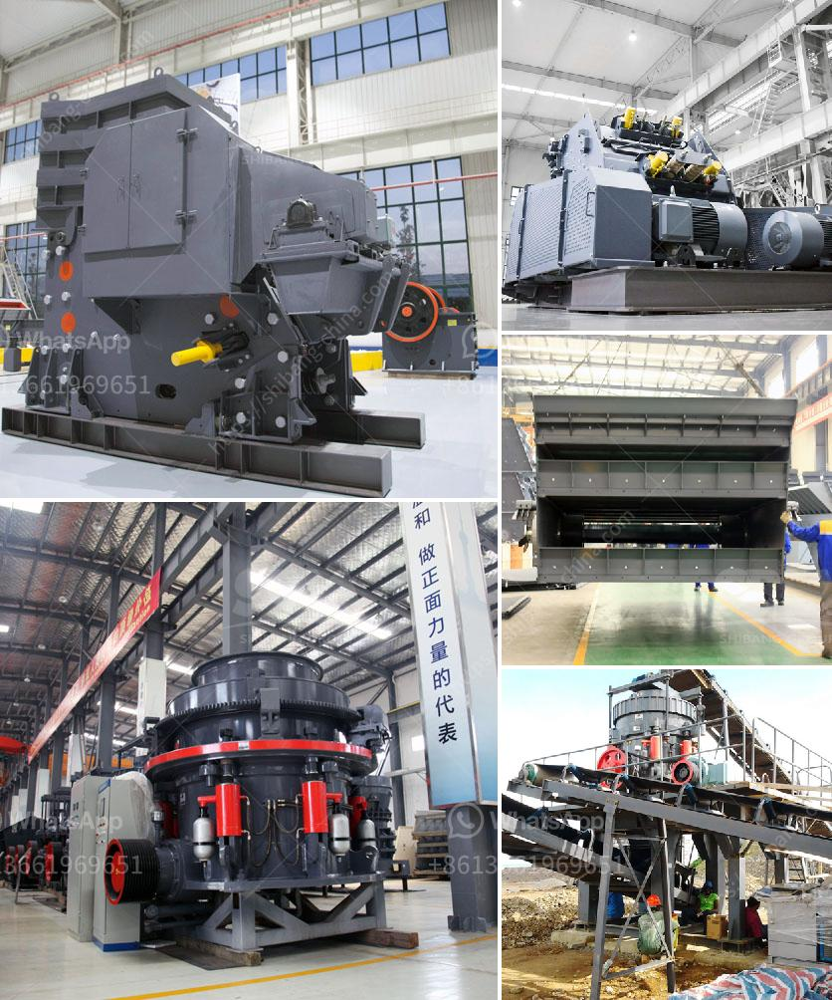

<h3>kenya stone crusher is made</h3>
The construction industry in Kenya is experiencing exponential growth and is poised to become the largest in East Africa by 2022. This growth is attributed to the increasing population, urbanization, and infrastructure development projects. As a result, there is a high demand for construction materials, particularly stone aggregates. To cater to this demand, the Kenya stone crusher has been developed to produce concrete aggregates and manufactured sand.

The demand for stone aggregates in Kenya is staggering. In 2019, the Kenya National Bureau of Statistics (KNBS) reported that the construction sector recorded the highest growth rate compared to other sectors, expanding by 6.4%. This growth is expected to continue, driving the need for stone aggregates for concrete production.

The Kenya stone crusher is designed to crush stone for different purposes. The processed stones are used for making concrete, building blocks, mortar, and plaster, among others. Various types of raw material are used in stone crushing units such as granite, limestone, basalt, river pebble, dolomite, and greenstone.

The main features of the Kenya stone crusher include the production capacity of 1-2 tons per hour, ideal diameters of the feeding material ranging from 200 to 300mm, adjusted size range of the discharge opening, and adjustable crushing bar configuration. The design ensures efficient crushing, reducing the material to the required size, and producing high-quality aggregates.

Additionally, the Kenya stone crusher is easy to operate and maintain. Its simple structure and straightforward design make it user-friendly, allowing operators to easily load and unload stones. The stone crusher is also equipped with advanced hydraulic technology, making it easy to control the crushing process and adjust the settings according to the specific requirements.

Furthermore, the Kenya stone crusher is cost-effective and energy-efficient. It consumes less electricity compared to other crushing machines, reducing operational costs and maximizing profits. The crusher is also equipped with a dust suppression system to minimize environmental pollution and maintain clean air quality.

The Kenya stone crusher is a great solution for contractors looking to produce quality aggregates for construction projects. It is especially useful in areas where raw materials are scarce or of low quality. By transforming raw stones into concrete aggregates, the Kenya stone crusher helps to improve the quality, durability, and strength of concrete, significantly enhancing construction projects' overall performance.

In conclusion, the Kenya stone crusher is a valuable addition to the construction industry. It provides a cost-effective solution for producing high-quality aggregates for various applications in infrastructure development. With its efficiency, ease of operation, and maintenance, the Kenya stone crusher is undoubtedly a game-changer in the construction sector, contributing to Kenya's growth and sustainable development.
<h3>Contact us</h3><ul><li><strong>Whatsapp:&nbsp;<a href="https://wa.me/8613661969651">+8613661969651</a></strong></li><li><a href="https://swt.shibang-china.com/?git&amp;zhl&amp;kenya stone crusher is made"><strong>Online Service(chat now)</strong></a></li></ul><h3>Related</h3><ul><li><a href='stone crushing in mineral processing.md'>stone crushing in mineral processing</a></li><li><a href='ballast processing machine.md'>ballast processing machine</a></li><li><a href='bentonite crushing manufacturing process.md'>bentonite crushing manufacturing process</a></li><li><a href='ball mills layout.md'>ball mills layout</a></li><li><a href='hard rock aggregates plant.md'>hard rock aggregates plant</a></li></ul>