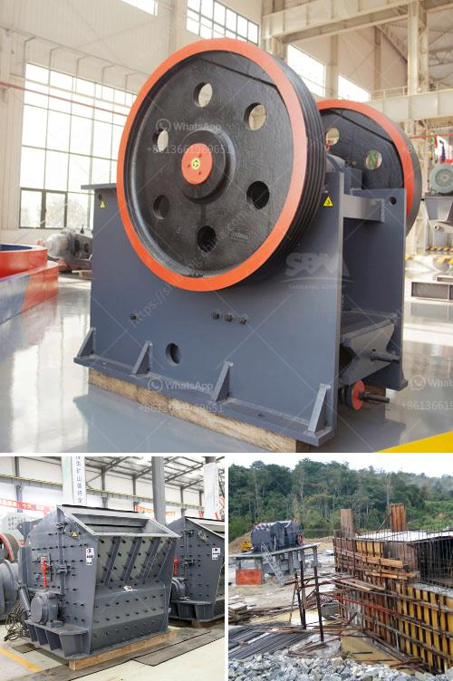

<h3>kobelco trituradora de cono</h3>
Kobelco is a renowned manufacturer of heavy machinery, known for its innovative and reliable equipment. One of its notable products is the Kobelco trituradora de cono, a cone crusher that has gained popularity in the mining and construction industry.

The Kobelco trituradora de cono, or cone crusher, is designed to crush high or medium hardness materials, such as granite, limestone, and river stones. It is used widely in mines, quarries, and construction sites to enhance the production efficiency and achieve a consistent product size.

One of the key features of the Kobelco trituradora de cono is its high crushing ratio. With an optimized design of the crushing chamber and eccentric throw, this cone crusher can deliver more crushing power, allowing it to handle even the toughest materials. Whether it's large rocks or hard ores, the Kobelco trituradora de cono can crush them with ease.

Another advantage of the Kobelco trituradora de cono is its excellent particle shape. The combination of its crushing mechanism and adjustable settings ensures a uniform product size, which is crucial in many applications. Whether it's for concrete aggregates or road construction, the cone crusher can produce high-quality crushed materials that meet the required specifications.

In addition to its impressive performance, the Kobelco trituradora de cono also offers ease of operation and maintenance. The cone crusher is equipped with various safety features to ensure the protection of both the operator and the machine. Additionally, it is designed with easy access to its components, allowing for quick and efficient maintenance.

The Kobelco trituradora de cono is available in different models and sizes to cater to various requirements. From small-scale projects to large-scale mining operations, there is a suitable model for every application. Moreover, Kobelco provides excellent after-sales support, including spare parts availability and technical assistance, ensuring the smooth operation of the cone crusher throughout its lifespan.

Overall, the Kobelco trituradora de cono is a reliable and efficient solution for crushing and processing materials in the mining and construction industry. Its high crushing ratio, excellent particle shape, and ease of operation make it a preferred choice for many professionals. Whether it's improving production efficiency or producing high-quality aggregates, the Kobelco trituradora de cono is up to the task.
<h3>Contact us</h3><ul><li><strong>Whatsapp:&nbsp;<a href="https://wa.me/8613661969651">+8613661969651</a></strong></li><li><a href="https://swt.shibang-china.com/?git&amp;zhl&amp;kobelco trituradora de cono"><strong>Online Service(chat now)</strong></a></li></ul><h3>Related</h3><ul><li><a href='grinding machine for salt in pakistan.md'>grinding machine for salt in pakistan</a></li><li><a href='stone crusher plant 100tph layout.md'>stone crusher plant 100tph layout</a></li><li><a href='used asphalt batch plant for sale in dubai.md'>used asphalt batch plant for sale in dubai</a></li><li><a href='jaw crusher for barite crushing.md'>jaw crusher for barite crushing</a></li><li><a href='jaw crusher machine supplier.md'>jaw crusher machine supplier</a></li></ul>