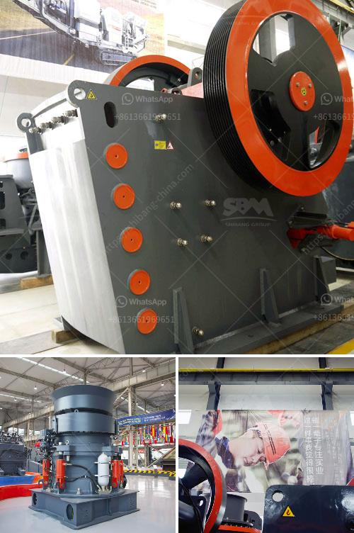

<h3>land rock crusher sale</h3>
When it comes to land development or construction projects, one common challenge is working with tough, solid rocks that make excavation and foundation preparation a tedious and time-consuming process. However, the introduction of land rock crushers has revolutionized the industry by making rock crushing quicker, more efficient, and cost-effective.

Land rock crushers are powerful machines designed to break large rocks into smaller, more manageable pieces. These machines utilize a strong force to crush the rocks, reducing them to the desired size for various applications such as road construction, building foundations, landscaping, or even agriculture. The crushed rocks can be used as base material for roads and driveways or as aggregate for concrete.

One of the key advantages of land rock crushers is their mobility. Unlike traditional crushers, land rock crushers are mounted on wheels or tracks, allowing operators to move them easily across different terrains. This is especially beneficial for land development projects that involve crushing rocks at multiple locations. Their versatility enables them to tackle challenging landscapes with ease, whether it's on rocky terrains or uneven surfaces.

In addition to their mobility, land rock crushers offer high efficiency and productivity. Equipped with powerful engines, these machines can process large quantities of rocks in a short period. This not only saves time but also reduces labor costs, making them an affordable solution for land preparation.

Furthermore, land rock crushers are available in various sizes and models, each designed to handle different rock types and sizes. Some machines are capable of crushing rocks as large as 2 feet in diameter, ensuring the flexibility to meet specific project requirements.

For those considering purchasing land rock crushers, there are many options available in the market. It's important to choose a reliable and reputable supplier to ensure the equipment's quality and performance. Additionally, understanding the specifications and capabilities of different models will help in selecting the right crusher for the intended application.

In conclusion, land rock crusher sales have become a game-changer in the world of construction and land development. Their ability to crush rocks efficiently, their mobility, and versatility make them a valuable asset for any project involving rock crushing. By investing in a land rock crusher, contractors and developers can save time, reduce costs, and overcome the challenges associated with working with solid rocks.
<h3>Contact us</h3><ul><li><strong>Whatsapp:&nbsp;<a href="https://wa.me/8613661969651">+8613661969651</a></strong></li><li><a href="https://swt.shibang-china.com/?git&amp;zhl&amp;land rock crusher sale"><strong>Online Service(chat now)</strong></a></li></ul><h3>Related</h3><ul><li><a href='static jaw crusher for sale in south africa.md'>static jaw crusher for sale in south africa</a></li><li><a href='crusher price malaysia.md'>crusher price malaysia</a></li><li><a href='crusher plant design.md'>crusher plant design</a></li><li><a href='the best crusher machines.md'>the best crusher machines</a></li><li><a href='dolamite powder machine.md'>dolamite powder machine</a></li></ul>