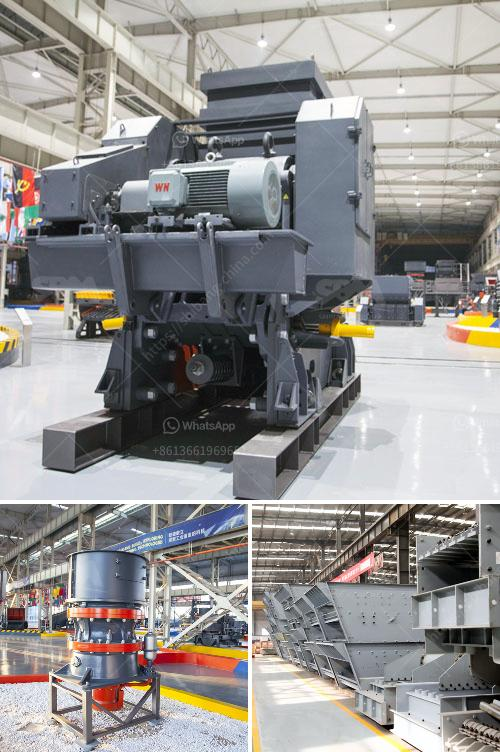

<h3>large scale mining vs small scale mining</h3>
Mining is an essential industry that plays a critical role in the global economy. However, there are two distinct methods employed in this sector: large-scale mining and small-scale mining. While both have their pros and cons, understanding the differences between these approaches is crucial for ensuring sustainable and responsible mining practices.

Large-scale mining refers to the extraction of minerals on a massive scale, often involving the use of heavy machinery and advanced technology. This method is typically employed by multinational mining corporations, which have the financial resources and expertise to undertake such operations. Large-scale mining offers several advantages, including significant economies of scale, increased productivity, and the ability to extract minerals at a lower cost. Furthermore, it contributes to the creation of jobs and economic growth in the regions where it operates.

However, large-scale mining also poses several risks and concerns. The extensive use of heavy machinery can lead to environmental degradation, including deforestation and habitat destruction. Moreover, the extraction of minerals often involves toxic substances, which, if not properly managed, can have detrimental effects on ecosystems and human health. Large-scale mining operations are also associated with social issues, such as displacement of local communities and the exploitation of labor.

On the other hand, small-scale mining refers to mining methods and practices employed by individuals and small companies with limited resources. While small-scale mining cannot match the output of large-scale operations, it still plays a crucial role in many developing countries' economies. Small-scale mining provides employment opportunities for local communities and allows individuals to generate income. Moreover, it often takes place in remote areas where alternative economic activities are limited.

However, small-scale mining is not without its challenges. Due to limited resources and equipment, the efficiency and productivity of small-scale operations are lower compared to large-scale mining. Environmental concerns also exist, as small-scale miners may use rudimentary methods that damage ecosystems. Additionally, informal small-scale mining can lead to unsafe working conditions and exploitation of labor.

In conclusion, both large-scale mining and small-scale mining have their advantages and disadvantages. While large-scale operations offer economic growth and job creation, they often result in significant environmental and social implications. Small-scale mining, although less impactful, struggles with inefficient practices and potential labor exploitation. It is essential for governments and stakeholders to establish regulations and provide support to mitigate the negative impacts of mining and promote sustainable practices in both large-scale and small-scale operations.
<h3>Contact us</h3><ul><li><strong>Whatsapp:&nbsp;<a href="https://wa.me/8613661969651">+8613661969651</a></strong></li><li><a href="https://swt.shibang-china.com/?git&amp;zhl&amp;large scale mining vs small scale mining"><strong>Online Service(chat now)</strong></a></li></ul><h3>Related</h3><ul><li><a href='difference between underground and open cast mining.md'>difference between underground and open cast mining</a></li><li><a href='sand dry vacuum machine truk.md'>sand dry vacuum machine truk</a></li><li><a href='stone crushing machines.md'>stone crushing machines</a></li><li><a href='sale of running stone crusher in philippines.md'>sale of running stone crusher in philippines</a></li><li><a href='fly ash grinding mill.md'>fly ash grinding mill</a></li></ul>