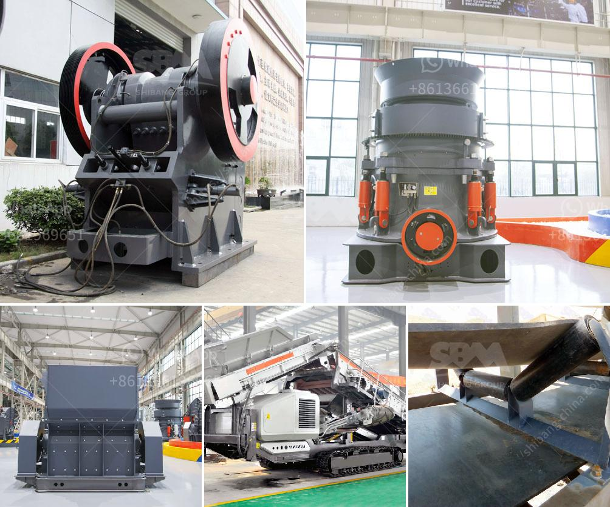

<h3>law requirements in stone crushing industry</h3>
The stone crushing industry is a crucial industrial sector in the world. The industry plays a major role in generating raw materials for various construction activities such as buildings, roads, bridges, highways, and more. There are stringent laws and regulations that govern the stone crushing industry to ensure responsible operations and protect the environment.

One of the primary laws governing the stone crushing industry is the Punjab Environmental Protection Act, 1997. The main objective of this law is to protect the environment by ensuring that no hazardous activities are carried out near residential or inhabited areas. Under this act, stone crushing units must obtain an environmental impact assessment (EIA) approval before establishing their operations.

The EIA report evaluates the potential environmental and social impacts of the stone crushing unit. It includes an assessment of air quality, water quality, noise levels, biodiversity, soil erosion, and other relevant factors. The report also recommends mitigation measures to minimize any adverse environmental impacts.

In addition to the EIA approval, stone crushing units are required to obtain a no-objection certificate (NOC) from the local authorities. The NOC ensures that the unit complies with all the legal requirements, including zoning regulations and health and safety standards. It also confirms that the unit is not located in a prohibited or restricted area.

Furthermore, stone crushing units must adhere to specific safety measures outlined in the Factories Act, 1948. This act mandates that all factories, including stone crushing units, ensure the safety, health, and welfare of workers. The act stipulates the provision of adequate ventilation, protection from hazardous substances, proper storage of materials, and maintenance of machinery, among other requirements.

To prevent pollution and safeguard the environment, stone crushing units must strictly adhere to the Water (Prevention and Control of Pollution) Act, 1974 and the Air (Prevention and Control of Pollution) Act, 1981. These acts outline regulations for controlling and reducing pollution from industrial activities. Stone crushing units must install pollution control devices such as dust containment systems and wastewater treatment plants to comply with these laws.

Moreover, stone crushing units must comply with the Mines and Minerals (Development and Regulation) Act, 1957. This act governs the licensing, leasing, and development of mines and minerals in India. Stone crushing units must obtain licenses or permits from the relevant government authorities to operate legally and sustainably.

Failure to comply with these legal requirements can result in penalties, fines, or even closure of the stone crushing unit. Additionally, non-compliant units may face legal action, hampering their operations and reputation.

In conclusion, the stone crushing industry is subject to several laws and regulations that aim to safeguard the environment, protect human health, and ensure responsible operations. These include obtaining EIA approvals, NOCs, adhering to the Factories Act, installing pollution control devices, and complying with the Mines and Minerals Act. It is essential for stone crushing units to abide by these legal requirements to operate sustainably and contribute positively to the construction industry while minimizing their impact on the environment.
<h3>Contact us</h3><ul><li><strong>Whatsapp:&nbsp;<a href="https://wa.me/8613661969651">+8613661969651</a></strong></li><li><a href="https://swt.shibang-china.com/?git&amp;zhl&amp;law requirements in stone crushing industry"><strong>Online Service(chat now)</strong></a></li></ul><h3>Related</h3><ul><li><a href='griding machine zenith.md'>griding machine zenith</a></li><li><a href='calculate crusher wear abrasion.md'>calculate crusher wear abrasion</a></li><li><a href='plant for manufacturing of wet ground calcium carbonate.md'>plant for manufacturing of wet ground calcium carbonate</a></li><li><a href='copper processing stages.md'>copper processing stages</a></li><li><a href='stone crusher mobile crusher layout.md'>stone crusher mobile crusher layout</a></li></ul>