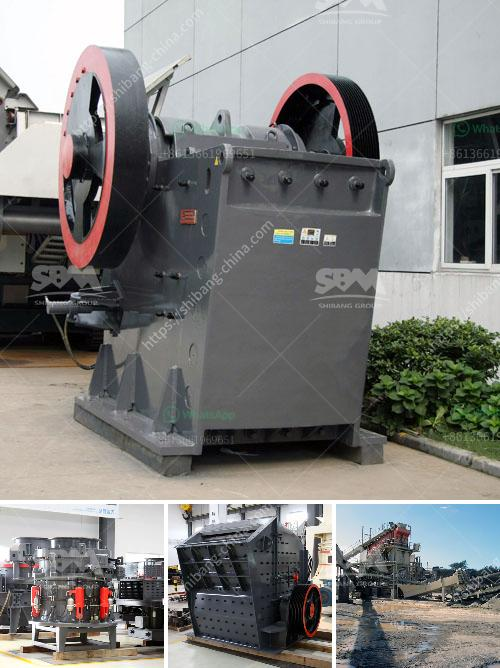

<h3>laying of conveyor belting</h3>
Conveyor belting plays a crucial role in various industries, enabling efficient material handling and smooth transportation of goods. Whether used in manufacturing plants, mining operations, or logistics facilities, conveyor belts are central to ensuring seamless operations and maximizing productivity. However, successful installation and proper laying of conveyor belting is essential for optimum performance and longevity.

When it comes to laying conveyor belting, attention to detail and adherence to recommended procedures are paramount. A well-executed installation not only ensures optimal belt tracking and alignment but also minimizes wear and tear, reduces downtime for maintenance and replacement, and ultimately, leads to cost savings.

To begin with, a strategic approach to laying conveyor belting starts with proper equipment selection. Choosing the right type of belt for the specific application is crucial to ensuring long-lasting performance and minimizing operational issues. Factors such as material type, weight, and size should be considered when selecting the appropriate belting.

Before laying the conveyor belting, it is essential to inspect and prepare the conveyor system thoroughly. This includes checking the alignment and condition of the idlers, pulleys, and rollers. Any worn or damaged components should be repaired or replaced to avoid potential failures that could disrupt operations. Additionally, ensuring the conveyor system is cleaned and free from debris or excess rust guarantees smooth installation and reduces the risk of contamination.

Next, accurate belt measurements are vital to ensure a proper fit. It is essential to carefully measure the length and width of the conveyor belt, ensuring an accurate assessment and preventing unnecessary tension or slackness. Proper tensioning of the belt is crucial to prevent slippage and maintain efficient operation. However, excessive tension can lead to premature wear or damage, while insufficient tension may cause belt tracking issues and compromise safety.

To ensure the conveyor belt is laid correctly, attention to detail during installation is critical. Start by unrolling the belt and aligning it parallel to the conveyor system, ensuring it is properly centered. The belt should be positioned so that the edges align evenly with the side frames of the conveyor, ensuring there is no overhang or misalignment. Proper alignment facilitates smooth material flow, minimizes spillage, and reduces the risk of damage to the belt.

Using appropriate techniques, such as stapling or vulcanizing, to join the ends of the belt together is crucial for securely fastening the belting. The chosen method should be performed carefully, following the manufacturer's guidelines and recommendations for optimal performance and durability.

Once the belt is installed, it is essential to verify its tracking and adjust if necessary. Improper tracking can lead to belt damage, increased wear, and reduced productivity. Regular inspections should be carried out to identify any misalignment or deviation from the correct tracking path, allowing for timely adjustments.

In conclusion, the laying of conveyor belting is a critical step in optimizing efficiency and productivity in material handling systems. Careful selection, thorough preparation, accurate measurements, and precise installation techniques are essential for ensuring long-lasting performance and minimizing operational issues. By prioritizing proper belt laying, businesses can maximize the potential of their conveyor systems, save costs through reduced downtime, and achieve smoother operations, ultimately leading to greater success in their respective industries.
<h3>Contact us</h3><ul><li><strong>Whatsapp:&nbsp;<a href="https://wa.me/8613661969651">+8613661969651</a></strong></li><li><a href="https://swt.shibang-china.com/?git&amp;zhl&amp;laying of conveyor belting"><strong>Online Service(chat now)</strong></a></li></ul><h3>Related</h3><ul><li><a href='ballast crusher cost.md'>ballast crusher cost</a></li><li><a href='cost of setting up mini cement plant.md'>cost of setting up mini cement plant</a></li><li><a href='crusher for bed ash manufacturers.md'>crusher for bed ash manufacturers</a></li><li><a href='calcium carbonate making machinery in germany.md'>calcium carbonate making machinery in germany</a></li><li><a href='hammer crusher in japan.md'>hammer crusher in japan</a></li></ul>