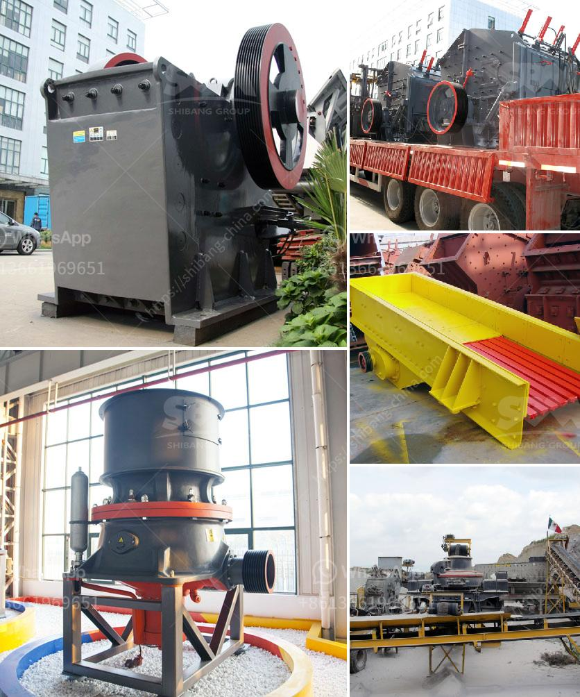

<h3>lime and dolomite plant division</h3>
Soil health plays a vital role in the development of healthy and productive crops. Farmers and scientists are constantly exploring ways to improve the quality of soil to ensure maximum yield and sustained agricultural success. One effective method, which has gained momentum in recent years, is the incorporation of lime and dolomite plants.

Lime and dolomite plants are dedicated divisions that focus on the production and supply of two important soil amendments: lime and dolomite. Both of these products are derived from rocks, but they serve different purposes when it comes to improving soil health.

Lime, commonly known as calcium oxide (CaO), is primarily used to neutralize acidic soils. The acidification of soil occurs due to various natural and anthropogenic factors. Continuous cropping, excessive use of fertilizers, or high rainfall can lead to soil acidification, which negatively impacts crop productivity. Lime acts as a buffer, raising the soil's pH level, and making it less acidic. This, in turn, helps promote the availability of essential nutrients, such as nitrogen, phosphorus, and potassium, for the plants. Additionally, lime also improves soil structure and microbial activity, promoting better root development and overall plant growth.

Dolomite, on the other hand, is a calcium-magnesium carbonate (CaMg(CO3)2) that provides additional benefits to soils. Along with neutralizing acidity, dolomite also helps in adding essential magnesium to the soil. Magnesium is a vital nutrient for plants, playing a crucial role in photosynthesis, enzyme activation, and protein synthesis. Moreover, magnesium deficiency in plants can lead to reduced chlorophyll production, resulting in stunted growth and decreased crop quality. By utilizing dolomite, farmers can ensure that the soil contains an adequate amount of magnesium for optimal plant growth.

The lime and dolomite plant divisions ensure the production and supply of these important amendments. With advanced mining techniques and sustainable practices, these divisions work towards extracting high-quality rocks that are then processed into lime and dolomite. Careful monitoring of the manufacturing process ensures that the final products are of the utmost quality, delivering the desired results when applied to the soil.

To incorporate lime or dolomite into the soil, farmers can utilize various methods. One common approach is to spread the amendments evenly across the field and incorporate them into the soil using traditional tillage practices. This allows for the amendments to mix with the soil, ensuring uniform distribution. Another method is the use of lime and dolomite spreaders, which enable efficient application and reduce manual labor.

The benefits of using lime and dolomite as soil amendments are numerous. Besides enhancing soil fertility, these amendments contribute to reduced soil erosion, improved water holding capacity, and increased nutrient availability. Furthermore, by correcting soil pH and nutrient imbalances, lime and dolomite promote the growth of healthier crops that are more resistant to pests and diseases.

In conclusion, incorporating lime and dolomite plants in agricultural practices is a valuable approach to enhancing soil health and crop production. These dedicated divisions ensure the production and supply of lime and dolomite, which act as potent soil amendments, neutralizing acidity and providing essential nutrients. By implementing these soil amendments, farmers can create a favorable environment for crop growth, leading to improved yields and sustained agricultural success.
<h3>Contact us</h3><ul><li><strong>Whatsapp:&nbsp;<a href="https://wa.me/8613661969651">+8613661969651</a></strong></li><li><a href="https://swt.shibang-china.com/?git&amp;zhl&amp;lime and dolomite plant division"><strong>Online Service(chat now)</strong></a></li></ul><h3>Related</h3><ul><li><a href='silicon wafer crusher.md'>silicon wafer crusher</a></li><li><a href='price for stone crusher plant.md'>price for stone crusher plant</a></li><li><a href='how to get aluminum from bauxite.md'>how to get aluminum from bauxite</a></li><li><a href='mobile crushing plant manufacturers.md'>mobile crushing plant manufacturers</a></li><li><a href='chinese jaw crusher.md'>chinese jaw crusher</a></li></ul>