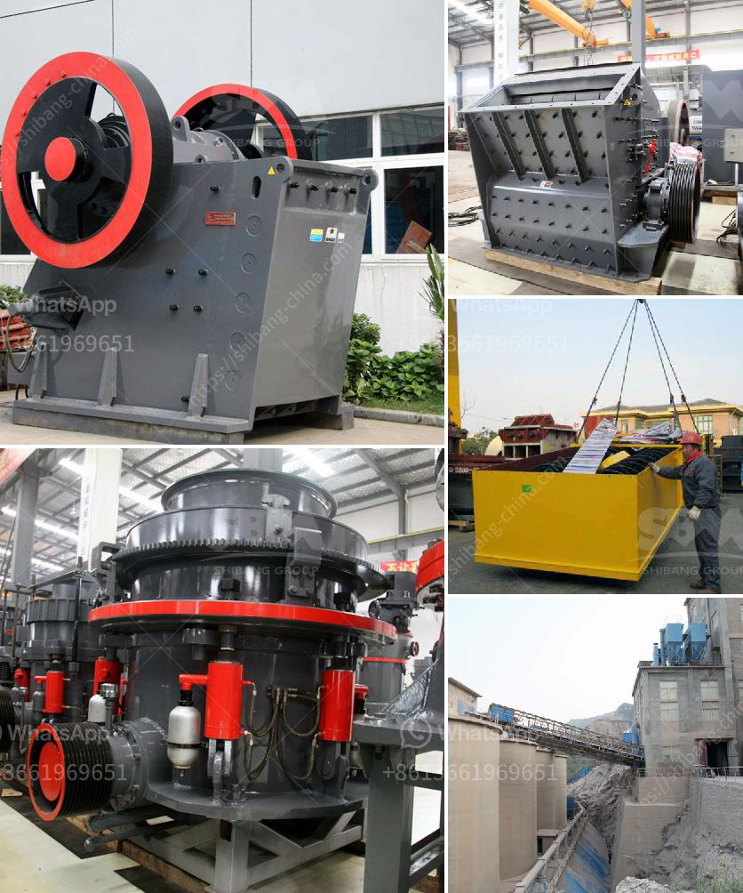

<h3>lime powder machine</h3>
Lime powder, also known as calcium oxide, plays a crucial role in various industries. It is widely used in manufacturing cement, steel, chemicals, and even in agriculture to regulate soil acidity. To meet the consistently growing demand for lime powder, manufacturers rely on lime powder machines, which efficiently process limestone to obtain high-quality lime powder.

A lime powder machine is designed to crush and grind limestone, a sedimentary rock primarily composed of calcium carbonate. The machine typically consists of a crushing unit, grinding unit, and a powder separating unit. The limestone is fed into the machine through a vibrating feeder, where it is evenly distributed across the crushing unit. The powerful rotating blades then crush the limestone into smaller particles.

Once crushed, the limestone is transferred to the grinding unit. Here, the limestone particles are finely ground into a powder using high-speed rotating grinding rollers. This process ensures that the lime powder obtained has a consistent particle size and high purity.

After grinding, the lime powder is separated from any impurities or larger particles through a powder separating unit. This unit uses air currents or vibrating screens to separate the lime powder and ensure its quality before it is collected in containers or conveyed for further processing or packaging.

One of the significant advantages of lime powder machines is their ability to process large quantities of limestone efficiently. With their powerful motors and advanced technology, these machines can crush and grind large volumes of limestone in a short period, significantly improving production efficiency.

Furthermore, lime powder machines are designed with safety features to prevent dust emissions and protect the environment and operators. These machines are equipped with dust collectors that effectively capture and remove dust particles, ensuring a clean and safe working environment.

In conclusion, lime powder machines have revolutionized the lime processing industry. Their high efficiency, accuracy in grinding, and superior separating capabilities have made lime production faster and more cost-effective. Manufacturers across various industries can rely on these machines to provide them with high-quality lime powder, contributing to the growth and success of their businesses.
<h3>Contact us</h3><ul><li><strong>Whatsapp:&nbsp;<a href="https://wa.me/8613661969651">+8613661969651</a></strong></li><li><a href="https://swt.shibang-china.com/?git&amp;zhl&amp;lime powder machine"><strong>Online Service(chat now)</strong></a></li></ul><h3>Related</h3><ul><li><a href='used raymond grinding mill sale in pakistan.md'>used raymond grinding mill sale in pakistan</a></li><li><a href='mobile jaw crusher for sale in pakistan.md'>mobile jaw crusher for sale in pakistan</a></li><li><a href='rotary grinder machine thailand.md'>rotary grinder machine thailand</a></li><li><a href='smallest mobile jaw crusher for sale south africa.md'>smallest mobile jaw crusher for sale south africa</a></li><li><a href='limestone rock crushing.md'>limestone rock crushing</a></li></ul>